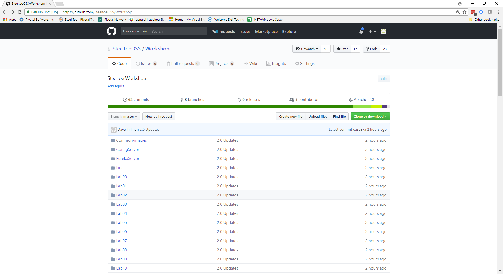
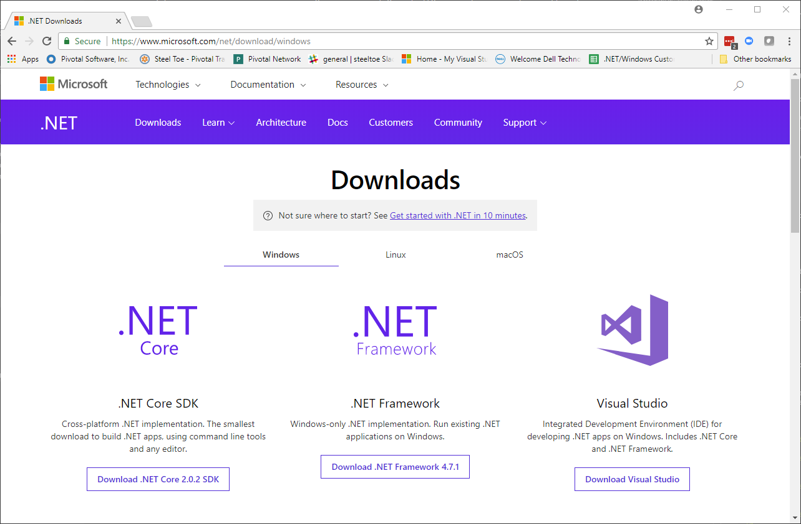
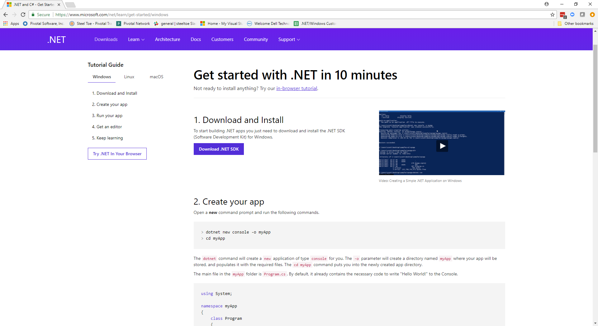
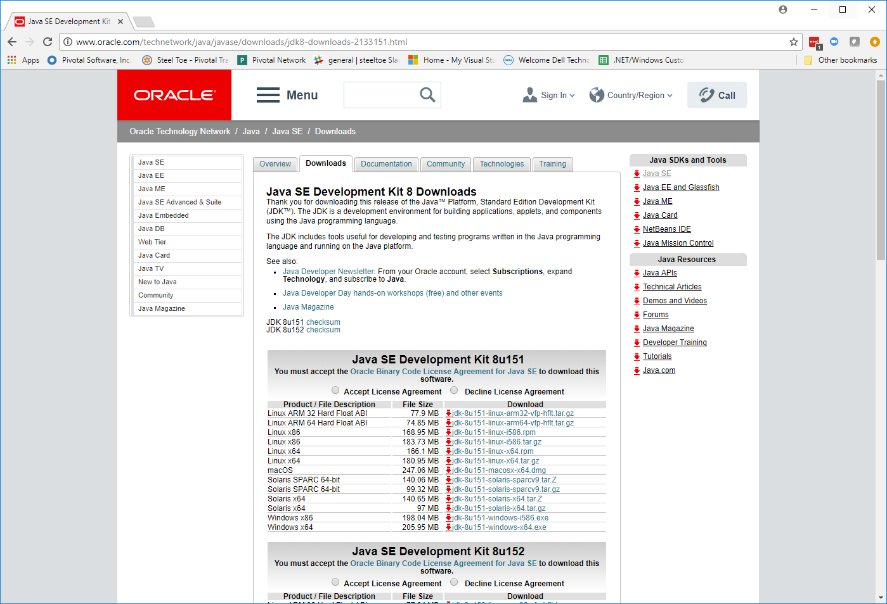

# Lab 0 - Workshop Environment Setup

## Install the Workshop GitHub Repository

1. If you haven't already done so, download and install the [Workshop Repository](https://github.com/SteeltoeOSS/Workshop).

   ---

   

   ---

## Install & Verify .NET Core SDK

1. If you haven't already done so, download and install the [.NET Core SDK](https://www.microsoft.com/net/download).

   ---

   

   ---
2. Follow the [10 minute - Get Started with .NET](https://www.microsoft.com/net/learn/get-started) tutorial to verify your .NET installation is working properly.

 ---

   

   ---

## Install and Verify Cloud Foundry CLI

1. If you haven't already done so, download the latest release of the [Cloud Foundry CLI](https://github.com/cloudfoundry/cli/releases) for your operating system and install it.

1. From a command prompt, set the Cloud Foundry target for the CLI.

   Note: Use the appropriate URL for your workshop environment.

   ```bash
   > cf api https://api.run.haas-76.pez.pivotal.io --skip-ssl-validation
   ```

1. Login to Cloud Foundry by following the prompts. Use the (student-X) username and password assigned to you by your instructor.

   ```bash
   > cf login
   API endpoint: https://api.run.haas-76.pez.pivotal.io

   Email> student-1

   Password>
   Authenticating...
   OK

   Targeted org student-1

   Targeted space development

   API endpoint:   https://api.run.haas-76.pez.pivotal.io (API version: 2.54.0)
   User:           student-1
   Org:            student-1
   Space:          development

   ```

## Access Pivotal Cloud Foundry Apps Manager

1. Login to the Pivotal Apps Manager using the URL appropriate for your setup. (e.g. <https://apps.run.haas-76.pez.pivotal.io>).

   Note: Use the same username and password you entered when logging in using the Cloud Foundry CLI above.

   ---

   

   ---

   Upon success, you should see a screen similar to below:

   ---

   

   ---

## Install & Verify Java JDK

1. If you haven't already done so, download and install the [Java 8 JDK](http://www.oracle.com/technetwork/java/javase/downloads/jdk8-downloads-2133151.html).

   ---

   

   ---

1. Verify you can run the Config Server locally on your machine. Open a command window and run:

   ```bash
   > cd Workshop/ConfigServer
   > mvnw spring-boot:run
    .....

   2017-11-13 16:58:13.306  INFO 134064 --- [           main] o.s.j.e.a.AnnotationMBeanExporter        : Located managed bean 'configurationPropertiesRebinder': registering with JMX server as MBean [org.springframework.cloud.context.properties:name=configurationPropertiesRebinder,context=526a122,type=ConfigurationPropertiesRebinder]
   2017-11-13 16:58:13.306  INFO 134064 --- [           main] o.s.j.e.a.AnnotationMBeanExporter        : Located managed bean 'refreshEndpoint': registering with JMX server as MBean [org.springframework.cloud.endpoint:name=refreshEndpoint,type=RefreshEndpoint]
   2017-11-13 16:58:13.406  INFO 134064 --- [           main] o.s.c.support.DefaultLifecycleProcessor  : Starting beans in phase 0
   2017-11-13 16:58:13.473  INFO 134064 --- [           main] s.b.c.e.t.TomcatEmbeddedServletContainer : Tomcat started on port(s): 8888 (http)
   2017-11-13 16:58:13.473  INFO 134064 --- [           main] demo.ConfigServerApplication             : Started ConfigServerApplication in 2.975 seconds (JVM running for 25.134)
   ```

1. Verify you can run the Eureka Server locally on your machine. Open a command window and run:

   ```bash
   > cd Workshop/EurekaServer
   > mvnw spring-boot:run
   .....

   2017-11-13 17:01:01.956  INFO 54544 --- [      Thread-10] c.n.e.r.PeerAwareInstanceRegistryImpl    : Changing status to UP
   2017-11-13 17:01:01.973  INFO 54544 --- [      Thread-10] e.s.EurekaServerInitializerConfiguration : Started Eureka Server
   2017-11-13 17:01:02.047  INFO 54544 --- [           main] s.b.c.e.t.TomcatEmbeddedServletContainer : Tomcat started on port(s): 8761 (http)
   2017-11-13 17:01:02.048  INFO 54544 --- [           main] c.n.e.EurekaDiscoveryClientConfiguration : Updating port to 8761
   2017-11-13 17:01:02.062  INFO 54544 --- [           main] eurekademo.EurekaApplication             : Started EurekaApplication in 6.203 seconds (JVM running for 19.889)
   ```