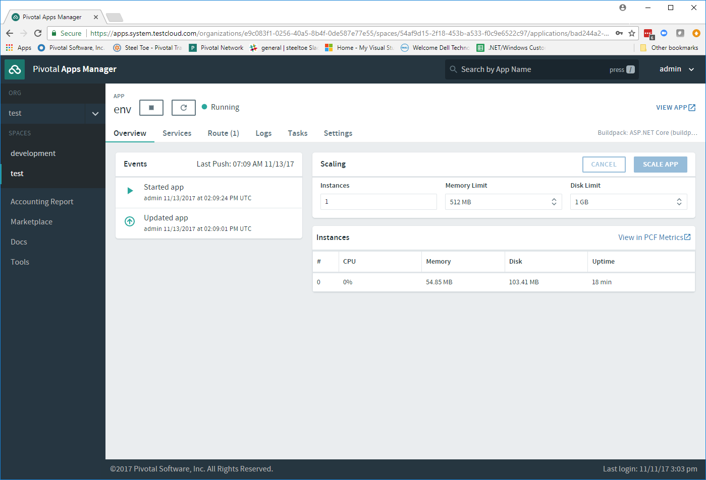

# Lab 3 - Scaling and Operating Applications

>Pivotal Cloudfoundry makes the work of performing actions, such as scaling, doing zero-downtime deployments, and managing application health very easy.  In this lab we'll explore some of these capabilities.

## Preparation

If your instance of the sample app `env` is not running after the steps completed in Lab 1, make sure to follow the [instructions](../Lab01/README.md) again to deploy the application.

## Scale Up the Application Instances

1. Its very easy to increase the number of instances of an application. To increase running application instances to 3, use the `cf scale` command as follows. 

   Note: When the CLI reports `OK`, it is letting you know that the additional requested instances have been started, but they are not yet necessarily all running.

   ```bash
   > cf scale env -i 3
   ```

1. You can determine how many instances are actually running like this:

   ```bash
   > cf app env
   Showing health and status for app env in org test / space test as admin...

   name:              env
   requested state:   started
   instances:         1/1
   usage:             512M x 1 instances
   routes:            env-undarned-tack.apps.testcloud.com
   last uploaded:     Wed 08 Nov 09:33:28 MST 2017
   stack:             cflinuxfs2
   buildpack:         ASP.NET Core (buildpack-1.0.22)

        state      since                    cpu    memory           disk         details
   #0   running    2016-10-16 08:37:52 PM   0.2%   113.4M of 512M   3.8M of 1G
   #1   starting   2016-10-16 08:53:26 PM   0.2%   110.2M of 512M   3.8M of 1G
   #2   starting   2016-10-16 08:53:26 PM   0.2%   111.6M of 512M   3.8M of 1G

   ```
   * The `#0` application instance has completed the startup process and is actually able to accept requests.
   * Application instances `#1` & `#2`  are still starting and will not have any requests routed to it.

1. Eventually all instances will converge to a running state and you will see something like this

   ```bash
   > cf app env
   Showing health and status for app env in org instructor / space development as admin...

   name:              env
   requested state:   started
   instances:         1/1
   usage:             512M x 1 instances
   routes:            env-undarned-tack.apps.testcloud.com
   last uploaded:     Wed 08 Nov 09:33:28 MST 2017
   stack:             cflinuxfs2
   buildpack:         ASP.NET Core (buildpack-1.0.22)

        state     since                    cpu    memory           disk         details
   #0   running   2016-10-16 08:37:52 PM   0.2%   113.4M of 512M   3.8M of 1G
   #1   running   2016-10-16 08:52:16 PM   0.0%   110.1M of 512M   3.8M of 1G
   #2   running   2016-10-16 08:52:17 PM   0.0%   111.5M of 512M   3.8M of 1G

   ```

1. Revisit the application route in the browser and select the `CloudFoundry Config` menu item. Refresh several times. You should observe the instance index (i.e. `vcap:application:instance_index`) changing as you refresh:

   ---

    

   ---

   The Cloud Foundry [(Go)Router](https://docs.pivotal.io/pivotalcf/1-7/concepts/architecture/router.html) is applying a random routing algorithm to all of the application instances assigned to its route. As an instance reaches the `running` state, the [Diego Cell](https://docs.pivotal.io/pivotalcf/1-8/concepts/diego/diego-architecture.html#architecture) that the instance is running on registers the instance in the routing table of the (Go)Router by sending a message to Cloud Foundry's message bus. All (Go)Router instances are subscribed to this bus and register the routes independently. This makes for very dynamic and rapid reconfiguration!

## Scale Down the Application Instances

1. We can scale the application instances back down as easily as we scaled them up. Use the same command:

   ```bash
   > cf scale env -i 1
   ```

1. Check the application status again to see the status.

   ```bash
   > cf app env
   Showing health and status for app env in org instructor / space development as admin...

   name:              env
   requested state:   started
   instances:         1/1
   usage:             512M x 1 instances
   routes:            env-undarned-tack.apps.testcloud.com
   last uploaded:     Wed 08 Nov 09:33:28 MST 2017
   stack:             cflinuxfs2
   buildpack:         ASP.NET Core (buildpack-1.0.22)

        state     since                    cpu    memory           disk         details
   #0   running   2016-10-16 08:37:52 PM   0.0%   113.8M of 512M   3.8M of 1G

   ```

   As you can see we're back down to only one instance running, and it is in fact the original index 0 that we started with.

1. Confirm by again revisiting the application in the browser and checking the instance index:

   ---

    

   ---

## HTTP Routing

1. There are two ways to discover what routes, or HTTP URLs, are mapped to an application. The first is available via the CLI. Simply enter `cf app env` and you'll see the list of routes in the section that says _routes_.

   ```bash
   > cf app env
   Showing health and status for app env in org instructor / space development as admin...

   name:              env
   requested state:   started
   instances:         1/1
   usage:             512M x 1 instances
   routes:            env-undarned-tack.apps.testcloud.com
   last uploaded:     Wed 08 Nov 09:33:28 MST 2017
   stack:             cflinuxfs2
   buildpack:         ASP.NET Core (buildpack-1.0.22)

        state     since                    cpu    memory           disk         details
   #0   running   2016-10-16 08:37:52 PM   0.2%   116.9M of 512M   3.8M of 1G

   ```

1. The second way is via the Apps Manager.  Click on the `env` application to view application details like shown below:

   ---

    

   ---

1. Select the _Routes_ tab to view a list of mapped routes:

   ---

    

   ---

1. We can easily add an additional route by clicking on _Map a Route_ button and supplying the new hostname and clicking on _Map_

   ---

    

   ---

1. Navigate to the new URL in your browser window.  You should see that same application displayed!

   ---

    

   ---

1. We can just as easily remove a route by clicking on _X_ on the route you wish to remove.

   ---

    

   ---

1. If you navigate to that URL you'll receive a HTTP 404 response.

   ---

    

   ---

1. This is how blue-green deployments are accomplished. Check the Pivotal [documentation](https://docs.pivotal.io/pivotalcf/1-7/devguide/deploy-apps/blue-green.html) for detailed instructions.

   ---

    

---
Continue the workshop with [Lab 4 - Monitoring Applications](../Lab04/README.md)