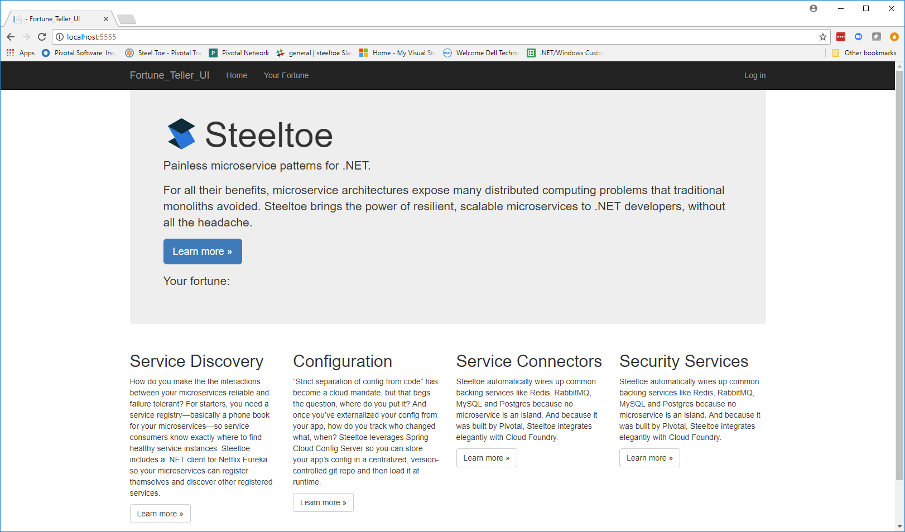
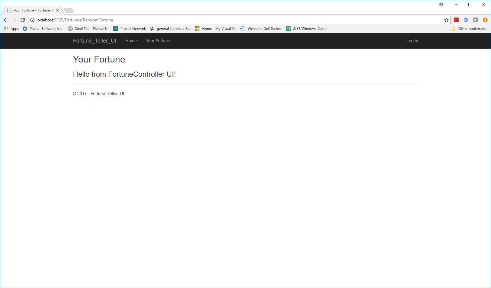
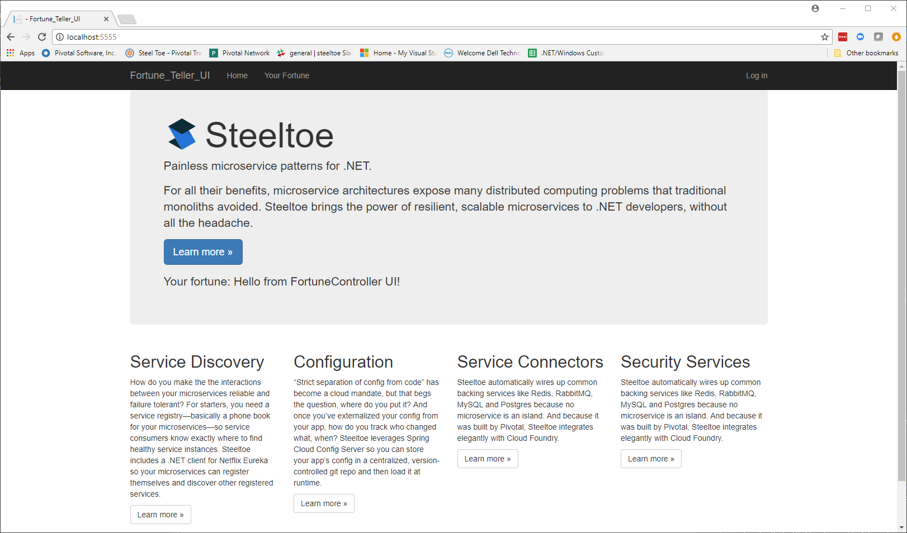

# Lab 5 - ASP.NET Core Programming Fundamentals

>Starting with this lab we will begin the process of creating a fully functional application which uses several of the Steeltoe components. We will be using a `Fortune Teller` micro-services based application as our staring point.

>The app consists of two components, a `Fortune Teller Service` which provides a REST API to serve up Fortunes and a `Fortune Teller UI` that can be used to display the retrieved Fortunes. In its current state, the app is not fully functional. The `Fortune Teller Service` only serves up a single `Fortune` and the `Fortune Teller UI` doesn't know how to communicate with the `Fortune Teller Service` and as such it always returns the same `Hello from FortuneController UI!` Fortune.

>The goals for this lab:

* Familiarize yourself with the Fortune-Teller lab code.
* Understand and apply the fundamentals of ASP.NET Core programming (e.g. Dependency injection, Configuration, Options, etc.)
* Become comfortable with running the lab application locally on your PC and publishing and deploying it to Cloud Foundry.
* Modify the `Fortune Teller Service`:
  * Hook up the `IFortuneRepository` to the `FortunesController`
  * Configure and use an in-memory EF Core database to store Fortunes.
  * Add the `IFortuneRepository` and the `FortuneContext` to the ASP.NET Core service container.
  * Initialize the Fortunes database with some Fortunes.
* Modify the `Fortune Teller UI`:
  * Hook up the `IFortuneService` to the `FortunesController`
  * Add the `IFortuneService` to the ASP.NET Core service container.
  * Use the `Options` framework to configure the `FortuneServiceClient` so that it can communicate with the `Fortune Service`
* Use Environments to have separate configurations for `Development` and `Production`.

>When you're done with this lab, the Fortune Teller UI should be able to retrieve random fortunes from the Fortune Service.

> For some background information on ASP.NET Core programming, have a look at the [ASP.NET Core documentation](https://docs.microsoft.com/en-us/aspnet/core).

## Review Fortune Teller Code

1. Start Visual Studio or Visual Studio Code and open the solution in the directory `Workshop/Start`.
1. Familiarize yourself with the `Fortune-Teller-Service` project and its code.
1. Familiarize yourself with the `Fortune-Teller-UI` project and its code.

## Run Fortune Teller Service in Command Window

1. Start a command window.
1. Change directory to the `Fortune-Teller-Service` project directory.

   ```bash
   > cd Workshop/Start/Fortune-Teller-Service
   ```
1. Restore the NuGet dependencies for the application.

   ```bash
   > dotnet restore --configfile nuget.config
   ```

1. Run the application.

   ```bash
   > dotnet run
   ```

1. Hit the REST endpoint <http://localhost:5000/api/fortunes/all>. You should see the following JSON returned:

   ```text
   [{"id":1,"text":"Hello from FortuneController Web API!"}]
   ```

## Run Fortune Teller UI in Command Window

1. Start a command window.
1. Change directory to the `Fortune-Teller-UI` project directory.

   ```bash
   > cd Workshop/Start/Fortune-Teller-UI
   ```
1. Restore the NuGet dependencies for the application.

   ```bash
   > dotnet restore --configfile nuget.config
   ```

1. Run the application.

   ```bash
   > dotnet run
   ```

1. Open <http://localhost:5555/> in your favorite browser. You should see the following:

    ---



   ---

1. Click on `Your Fortune` in the menu. You should see the following.  The `Your Fortune` action saves whatever fortune it obtains in the application's session.

    ---



   ---

1. Click on `Home` in the menu. You should see the following.  Notice `Your fortune: Hello from FortuneController UI!`.  This is the fortune retrieved from the application's session state.

    ---



   ---

## Run/Debug Fortune Teller in VS2017

1. Terminate command window running `Fortune-Teller-Service` if still running.
1. Open `Workshop/Start/Fortune-Teller.sln`
1. Set `Fortune-Teller-Service` project to be `Startup project`.
1. Hit F5 or CTRL-F5 to startup the application.
1. Verify application is running correctly.
1. Terminate the running application.
1. Repeat steps 3-4 for the `Fortune-Teller-UI` project.
1. Verify application is running correctly.
1. Stop all applications.

## Push Fortune Teller Service to Cloud Foundry

1. Start a command window.
1. Change directory to the `Fortune-Teller-Service` project directory.

   ```bash
   > cd Workshop/Start/Fortune-Teller-Service
   ```
1. Restore the NuGet dependencies for the application.

   ```bash
   > dotnet restore --configfile nuget.config
   ```

1. Publish the application to run on a Linux cell.

   ```bash
   > dotnet publish -r ubuntu.14.04-x64
   ```

1. Push the published app using `manifest.yml`.

   ```bash
   > cf push -f manifest.yml -p bin/Debug/netcoreapp2.0/ubuntu.14.04-x64/publish
   ```

1. Hit the REST endpoint and verify its running properly. Use `cf app fortuneservice` to see what route was assigned.

   ```bash
   > cf app fortuneservice
   ```

## Push Fortune Teller UI to Cloud Foundry

1. Start a command window.
1. Change directory to the `Fortune-Teller-UI` project directory.

   ```bash
   > cd Workshop/Start/Fortune-Teller-UI
   ```
1. Restore the NuGet dependencies for the application.

   ```bash
   > dotnet restore --configfile nuget.config
   ```

1. Publish the application to run on a Linux cell.

   ```bash
   > dotnet publish -r ubuntu.14.04-x64
   ```

1. Push the published app using `manifest.yml`.

   ```bash
   > cf push -f manifest.yml -p bin/Debug/netcoreapp2.0/ubuntu.14.04-x64/publish
   ```

1. Hit the application endpoint and verify that it is running properly. Use `cf app fortuneui` to see what route was assigned.

   ```bash
   > cf app fortuneui
   ```

## Modify Fortune Teller Service

You will be using ASP.NET Core `Dependency Injection` features for much of the next set of exercises. For some background information on how it works, have a look at this [documentation](https://docs.microsoft.com/en-us/aspnet/core/fundamentals/dependency-injection)

Also, in this step you will make use of the `Entity Framework Core` features. For some background information on it, have a look at this [documentation](https://docs.microsoft.com/en-us/ef/#pivot=efcore).

As you work through this section and the next, if you get stuck or are not sure how to proceed, you can always take a look at the finished code for this lab in the `Workshop/Lab05` directory.

### Step 01 - Modify FortunesController to use the IFortuneRepository

1. Modify the `FortunesController` to accept an injected `IFortuneRepository`. You can find the already existing code for `FortuneRepository` in the `Models` folder.
1. Modify each of the `FortunesController` actions to use the injected `IFortuneRepository` to obtain Fortunes.

### Step 02 - Add IFortuneRepository and FortuneContext to Service Container

1. Make the changes needed to the `Startup` class to get the `IFortuneRepository` into the service container so it can be injected into the `FortunesController`.

   Notice that the `FortuneRepository` takes a `FortuneContext` as a argument to its constructor. So you will also need to add a `FortuneContext` to the container. But a `FortuneContext` is built on the `EntityFrameworkCore` library, so you will also need to add that to the container as well.

   At this point in the workshop, we will simply use an in-memory EFCore database. Clearly, if this DbContext was being updated, this in-memory database would be a bad choice as it would prohibit us from scaling this micro-service horizontally. In an upcoming Lab on scaling, we will show you how to use Steeltoe connectors to connect the `DbContext` to a real back-end database.

1. Make the changes needed to the `Startup` class to get Entity Framework Core components added into the service container.

### Step 03 - Initialize FortuneContext with some Fortunes

1. Add some Fortunes to the `FortuneContext`.

   We have already written the code to do that for you. You can make use of the static method `SampleData.InitializeFortunesAsync()`. The question you have to answer is where do you add this? Have a look at the method and notice that the code asks the container for an instance of the `FortuneContext` in order to initialize it with samples. As a result, the container needs to be built before we call this method and also before we start handling any requests. So the best place to add this call is in the `Configure` method in the `Startup` class.

### Step 04 - Run Locally

Run and verify the `Fortune-Teller-Service` returns the Fortunes from the in-memory database. Run the application in either a command window or VS2017.

### Step 05 - Push to Cloud Foundry

1. Publish, push and verify the application runs on Cloud Foundry.

## Modify Fortune Teller UI

You will be using ASP.NET Core `Dependency Injection` features for much of the next set of exercises. For some background information on how it works, have a look at this [documentation](https://docs.microsoft.com/en-us/aspnet/core/fundamentals/dependency-injection)

Also, in this step you will make use of the Configuration and Options features of the ASP.NET Core framework. For some background information on it, have a look at this [documentation](https://docs.microsoft.com/en-us/aspnet/core/fundamentals/configuration?tabs=basicconfiguration).

### Step 01 - Modify FortunesController to use the IFortuneService

1. Modify the `FortunesController` to accept an injected `IFortuneService`. You can find the already existing code for `FortuneServiceClient` in the `Services` folder.
1. Modify each of the `FortunesController` actions to use the injected `IFortuneService` to obtain Fortunes.

### Step 02 - Add IFortuneService to Service Container

1. Make the changes needed in the `Startup` class to get the `IFortuneService` into the service container so it can be injected into the `FortunesController`.

### Step 03 - Configure IFortuneService

1. Modify the `appsettings.json` file with the configuration information needed to configure the `FortuneServiceClient`.  The settings you provide will be used by the client so that it can communicate with the Fortune Service.

   >**Note:** the FortuneServiceClient expects to receive an injected `IOptionsSnapshot<FortuneServiceOptions>`. Look at the existing `FortuneServiceOptions` class and the client code to see what properties need to be filled in.

1. Modify the `Startup` class to make use of the `Options` framework to configure the `FortuneServiceOptions` from the values in `appsettings.json` and to add it to the service container so that it will be injected.

### Step 04 - Modify FortuneTellerClient

1. Modify the FortuneTellerClient to make the REST call to the FortuneTeller service.

### Step 05 - Run both Locally

1. Run the `Fortune-Teller-Service` in either a command window or VS2017.
1. Run the `Fortune-Teller-UI` in either a command window or VS2017.
1. Verify that the UI can communicate with the Fortune service.

### Step 06 - Push both to Cloud Foundry

1. Publish and push the `Fortune-Teller-Service` to Cloud Foundry.
1. Modify the UI `appsettings.json` file to configure it to run properly on Cloud Foundry.
1. Publish and push the `Fortune-Teller-UI` to Cloud Foundry.
1. Verify that the UI can communicate with the Fortune service.

## Development and Production Configurations

In this exercise we will be modifying the `appsettings.Development.json` file to hold the configuration data for when we are running in `Development` mode.

### Step 01 - Modify appsettings.Development.json

In this step we want to modify the JSON configuration file in each project with configuration parameters that will be used we are running in `Development` mode.

1. Make the changes so that any classes under the following namespaces will log at `Debug` level:

* `Fortune_Teller_Service`
* `Fortune_Teller_UI`
* `Pivotal`
* `Steeltoe`

### Step 02 - Run Locally

1. Change the `ASPNETCORE_ENVIRONMENT` environment variable to `Development`.
1. Run and verify debug logging happens in each component. Run the application in either a command window or VS2017.

### Step 03 - Push to Cloud Foundry

1. Change the `ASPNETCORE_ENVIRONMENT` environment variable to `Development` in the `manifest.yml` file.
1. Publish, push and verify debug logging happens in each component.

---
Continue the workshop with [Lab 6 - Centralized Application Configuration - Config Server](../Lab06/README.md)