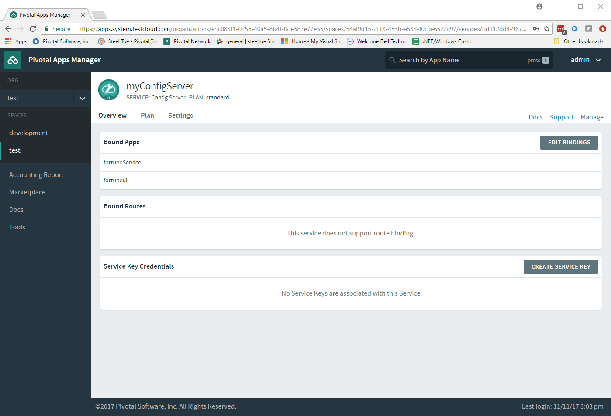
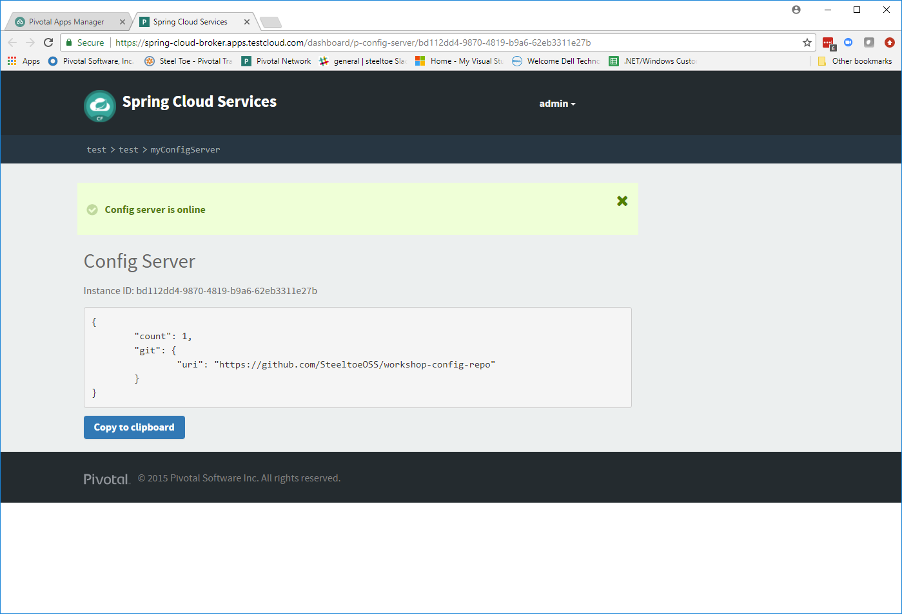

# Lab 6 - Centralized Application Configuration

>In this lab we will continue to add functionality to the Fortune Teller application. We will explore how to use the ASP.NET Core Configuration services and how to add the Config Server as a source of configuration data using the Steeltoe Config Server provider.

>After completing Lab05, the app state should be as follows:

* The `Fortune Teller Service` uses a in-memory database to hold Fortunes.
* The `Fortune Teller Service` serves up random fortunes from the database.
* The `Fortune Teller UI` uses a `FortuneServiceClient` and is able to communicate with the `Fortune Teller Service`.

>The goals for Lab 6 are:

* Use Config Server to centralize configuration for both applications.

>For background information, see: [ASP.NET Core Configuration documentation](https://docs.microsoft.com/en-us/aspnet/core/fundamentals/configuration) and [ASP.NET Core Environment documentation](https://docs.microsoft.com/en-us/aspnet/core/fundamentals/environments).

## Use Config Server Locally

In this exercise we will startup a Config Server locally and move our configuration data to the locally running Config Server. We will also make the changes necessary to pull the configuration data from the Config Server into our application. Specifically, we will use the `Steeltoe Config Server client` to pull config data from the Config Server.

>For background information, see: [Cloud Config Server documentation](https://projects.spring.io/spring-cloud/).

### Step 01 - Run Config Server Locally

Here we setup and run a Config Server locally, for easier development and testing.

1. Open a command window and change directory to _Workshop/ConfigServer_

   ```bash
   > cd Workshop/ConfigServer
   ```

1. Startup the Config Server

   ```bash
   > ./mvnw spring-boot:run
   ```

   It will start up on port 8888 and serve configuration data from `Workshop/ConfigServer/steeltoe/config-repo`.  You can verify the config server is running via the health check endpoint http://localhost:8888/admin/health

### Step 02 - Add Steeltoe Config Server Client Nuget

For each project, make changes to your `.csproj` files to include the Steeltoe Config Server provider NuGet.

### Step 03 - Add Steeltoe Config Server provider to ConfigurationBuilder

For each project, make changes to `Program.cs` to add the Steeltoe Config Server provider to the `ConfigurationBuilder`.

### Step 04 - Configure the Config Server Client

For each project, make changes to `appsettings.json` to configure the Steeltoe Config Server client.
At a minimum, we need to tell the client what URL to use to make requests of the Config Server and what configuration data to request.

Use `spring:application:name` to configure the name of the application for each project. Use the following names:

* Fortune_Teller_Service - use `fortuneService`
* Fortune_Teller_UI - use `fortuneui`

### Step 05 - Centralize configuration data

In this step we move some of the configuration data from both of the `appsettings` files to files in the _Workshop/ConfigServer/steeltoe/config-repo_.  This is the directory the Config Server that we started above uses to serve configuration data.

You will want to establish four files in the _Workshop/ConfigServer/steeltoe/config-repo_ directory.  At this point some of these files may be empty, but in future labs we will be adding additional configuration data.

* application-Development.yml
* application.yml
* fortuneService.yml
* fortuneui.yml

Go through your `appsettings.json` and `appsettings.Development.json` files and move configuration data into the most appropriate files above. For example, the common logging configuration for both FortuneUI and Fortune Service could combined and moved into application.yml and application-Development.yml. Configuration information that is specific for FortuneUI, could be added to fortuneui.yml.

When you're done, the only thing left in `appsettings.json` should be configuration data needed by the Config Server client.

### Step 06 - Run Locally

Run both Fortune-Teller applications to verify they run as they did before centralizing the configuration. Run the applications in either a command window or VS2017.

## Use Config Server on Cloud Foundry

### Step 01 - Create Config Server Service Instance

To create an instance of the Config Server service in your org/space and populate it with configuration data, follow these instructions:

1. Create your own GitHub repo to hold your Config Server data.
1. Open a command window and change directory to your starting lab point.

   ```bash
   > cd Workshop/Start
   ```
1. In Visual Studio, open the `config-server.json` file in the solution folder.
1. Modify its contents to point to the GitHub repo you just created above.
1. Using the command window, create an instance of the config server on Cloud Foundry. When we create it, we will set its configuration using the config-server.json file we modified above:

   ```bash
   > cf create-service p-config-server standard myConfigServer -c config-server.json
   ```
1. Add the contents of _Workshop/ConfigServer/steeltoe/config-repo_ to the GitHub repo you just created.
1. Wait for the service to become available on Cloud Foundry before proceeding to the next step.

   ```bash
   > cf services
   ```

### Step 02 - Configure Service Binding

You need to configure your applications to bind to the Config Server service instance you created above.

Open the `manifest.yml` files for both projects and add a `services` section and include the Config Server instance you created above.

### Step 03 - Using Self-Signed Certificates

In some cases you may find that your Cloud Foundry setup has been installed using self-signed certificates.  If that is the case, you will likely run into certificate verification errors when communicating with the Config Server.  If that is the case you can disable certificate validation by adding
`spring:cloud:config:validate_certificates=false` to your configuration file.

Check with your instructor to see if you need to do this. If you do, you will need to do this for each project.

### Step 04 - Push to Cloud Foundry

Publish, push and verify the applications run on Cloud Foundry. Make any adjustments to the configuration in GitHub to get the applications to work properly.

### Step 05 - Explore Config Server Service in AppsManager

1. Open and Login to Pivotal AppsManager in a browser.

1. Select your Org and Space and view the two Fortune Teller applications.

    ---


   ---

1. Select the services tab and select Config Server instance.

    ---



   ---

1. Select the Manage link to view the detail configuration of the Config Server.

    ---



---
Continue the workshop with [Lab 7 - Service Discovery - Eureka Server](../Lab07/README.md)
