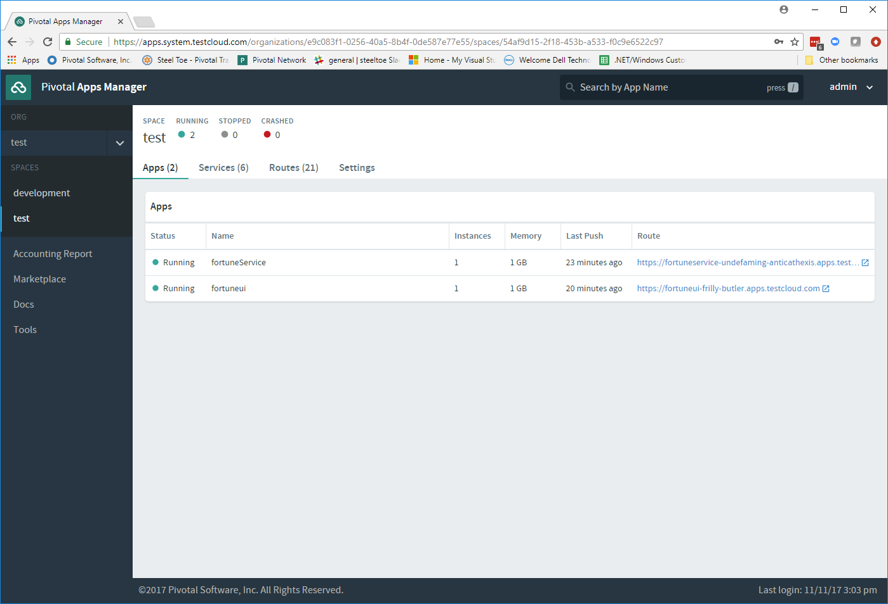
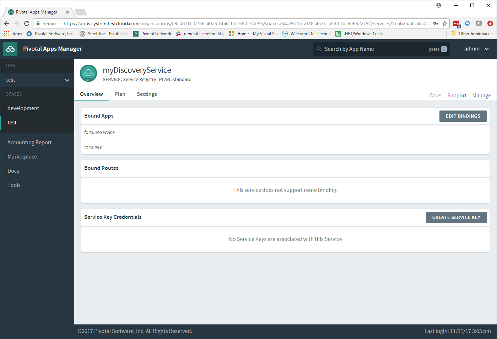
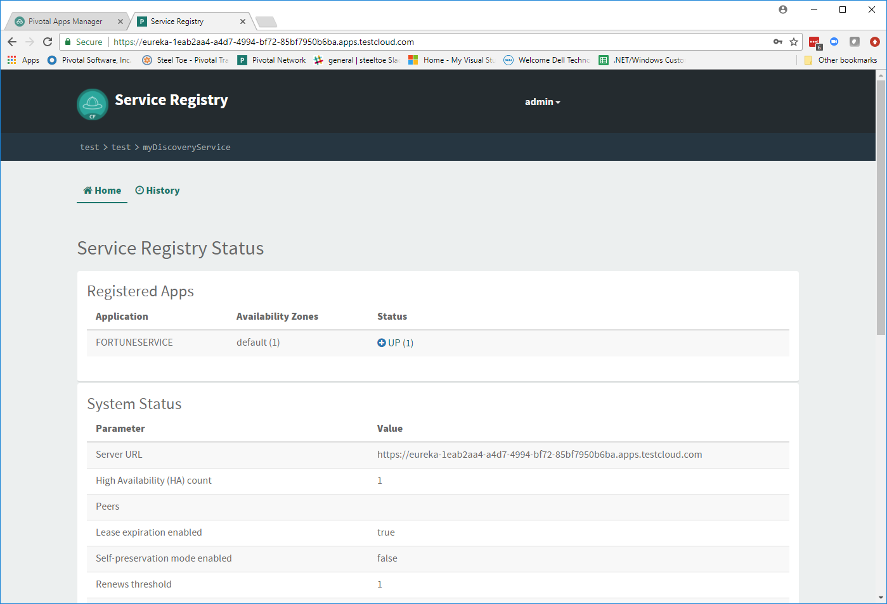

# Lab 7 - Service Discovery

>In this lab we will continue to add functionality to the Fortune Teller application. We will learn how to use Netflix Eureka for service registration and discovery using the Steeltoe Discovery client.

>After completing Lab06, the app state should be as follows:

* The `Fortune Teller Service` uses a back-end in-memory database to hold Fortunes.
* The `Fortune Teller Service` serves up random fortunes from the database.
* Both components have their configuration centrally maintainable.
* The `Fortune Teller UI` uses a `FortuneServiceClient` to communicate with the `Fortune Teller Service`.
* Unfortunately we have to reconfigure the `Fortune Teller UI` every time we change the address of the `Fortune Teller Service`

>The goals for Lab 7 are to:

* Use Eureka Server for Service Registration and Discovery
* Use Steeltoe Discovery client to register and discover the address of the `Fortune Teller Service`

## Preparation

### Step 01 - Run Config Server Locally

We are still using the Config Server, so make sure it is running locally for easier development and testing.

1. Open a command window and change directory to _Workshop/ConfigServer_

   ```bash
   > cd Workshop/ConfigServer
   ```

1. Startup the Config Server

   ```bash
   > ./mvnw spring-boot:run
   ```

   It will start up on port 8888 and serve configuration data from `Workshop/ConfigServer/steeltoe/config-repo`.

## Use Eureka Server Locally

In this exercise we will startup a Eureka Server locally and update our Fortune Teller code to register and discover the address of the Fortune Teller service.  Specifically, we will use the Steeltoe Eureka client to register and discover the service address.

### Step 01 - Run Eureka Server Locally

For an easier development and testing experience, setup and run a Eureka Server locally:

1. Open a command window and change directory to _Workshop/EurekaServer_

   ```bash
   > cd Workshop/EurekaServer
   ```

1. Startup the Eureka Server

   ```bash
   > mvnw spring-boot:run
   ```

It will start up on port 8761 and serve the Eureka API from "/eureka".

### Step 02 - Add Steeltoe Discovery Client Nuget

For each project make changes to your `.csproj` files to include the Steeltoe Discovery Client NuGet.

When using a Eureka Server on PCF or the Eureka Server from Open Source, we use the Nuget:

* `Pivotal.Discovery.ClientCore`

When just planning on using Eureka Server from Open Source, we can use Nuget:

* `Steeltoe.Discovery.ClientCore`

### Step 03 - Add Steeltoe Discovery Client to Service Container

For each project make changes to `Startup.cs` to add the Steeltoe Discovery client to the service container and to start the client running in the background pulling and/or registering services.

### Step 04 - Configure the Discovery Client

Once we have the Discovery client added to the service container we next need to configure the client. We have two sets of Discovery client configuration data to provide, one for the `Fortune Teller Service` and the other for `Fortune Teller UI`.

The `Fortune Teller Service` should register itself with the Eureka Server with the name `fortuneservice` and when we are running it locally, it will be listening on port `5000`. Also, we don't need it to fetch any services as it doesn't make any external service requests, so we should disable fetching the registry.

The `Fortune Teller UI` should fetch registered services, but we don't need to register, as it has no external REST endpoints it needs to expose.

And finally, for both, we need to configure the URL endpoint of the Eureka Server, so that both know how to contact the server.

For each project make the changes in `Workshop/ConfigServer/steeltoe/config-repo` to make this happen. You will want to make changes in:

* application.yml
* fortuneui.yml
* fortuneService.yml

### Step 05 - Discover Services - DiscoveryHttpClientHandler

The last code change we have to make to get the Discovery service fully implemented is to change the `FortuneServiceClient` to use the `IDiscoveryClient`. The `AddDiscoveryClient(Configuration)` that we added to `Startup.cs` adds `IDiscoveryClient` to the service container. To gain access to this in the `FortuneServiceClient`,  we will need to add `IDiscoveryClient` to its constructor.

Once this is done, we could go ahead and use `IDiscoveryClient` directly to lookup services, but instead what we want to do instead is to use another Steeltoe component `DiscoveryHttpClientHandler` to make our life easier. The `DiscoveryHttpClientHandler` is an `HttpClientHandler` that can be used with `HttpClient` to intercept any client requests and evaluate the request URL to see if the address portion of the URL can be resolved from the service registry. In this case we will use it to resolve the `fortuneService` name into an actual `host:port` before allowing the request to continue. If the name can't be resolved, the handler will still allow the request to continue, but of course the request will fail.

Make the necessary changes in `FortuneServiceClient` to accomplish the above.

### Step 06 - Configure FortuneServiceClient

Now that we are using the Discovery service, you will need to alter the configuration of the FortuneServiceClient. Make the changes necessary so that the client can communicate with the Fortune Teller service.

### Step 07 - Run Locally

Run and verify both Fortune-Tellers continue to run as they did before. Run the application in either a command window or VS2017.

## Use Eureka Server on Cloud Foundry

### Step 01 - Create Eureka Server Service Instance

To create an instance of the Eureka Server service in your org/space follow these instructions:

1. Open a command window.

1. Using the command window, create an instance of the Eureka server on Cloud Foundry.

   ```bash
   > cf create-service p-service-registry standard myDiscoveryService
   ```

1. Wait for the service to become available on Cloud Foundry.

   ```bash
   > cf services
   ```

### Step 02 - Configure Service Binding

You need to configure your applications to bind to the Eureka Server service instance you created above.

Open the `manifest.yml` files for both projects and add to the services section the Eureka Server instance you created above.

### Step 03 - Using Self-Signed Certificates

In some cases you may find that your Cloud Foundry setup has been installed using self-signed certificates. If that is the case, you will likely run into certificate verification errors when communicating with the Eureka Server. If that is the case you can disable certificate validation by adding `eureka:client:validate_certificates=false` configuration file.

Check with your instructor to see if you need to do this. If you do, you will need to do this for each project.

### Step 04 - Push to Cloud Foundry

Publish, push and verify the application runs on Cloud Foundry. Make any adjustments to the configuration in GitHub to get the application to work properly.

### Step 05 - Explore Eureka Server Service in AppsManager

1. Open and Login to Pivotal AppsManager in a browser.

1. Select your Org and Space and view the two Fortune Teller applications.

---



---

3. Select the services tab and select Eureka Server instance.

---



---

4. Select the Manage link to view the detail configuration of the Eureka Server.

---



---
Continue the workshop with [Lab 8 - Scaling Horizontally - Redis and Mysql Services](../Lab08/README.md)