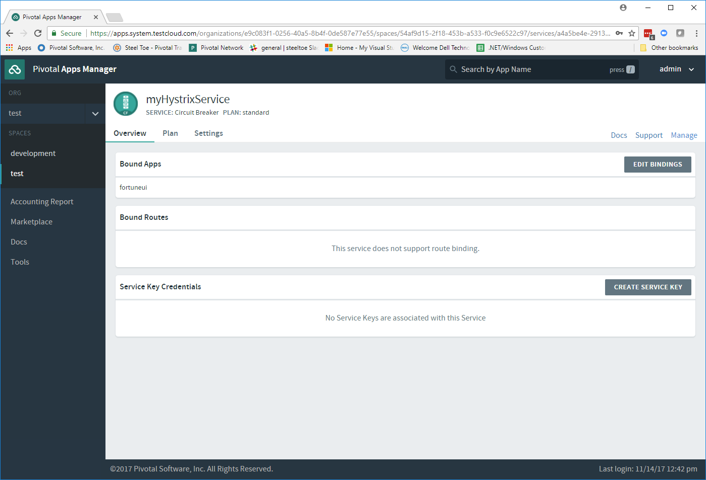
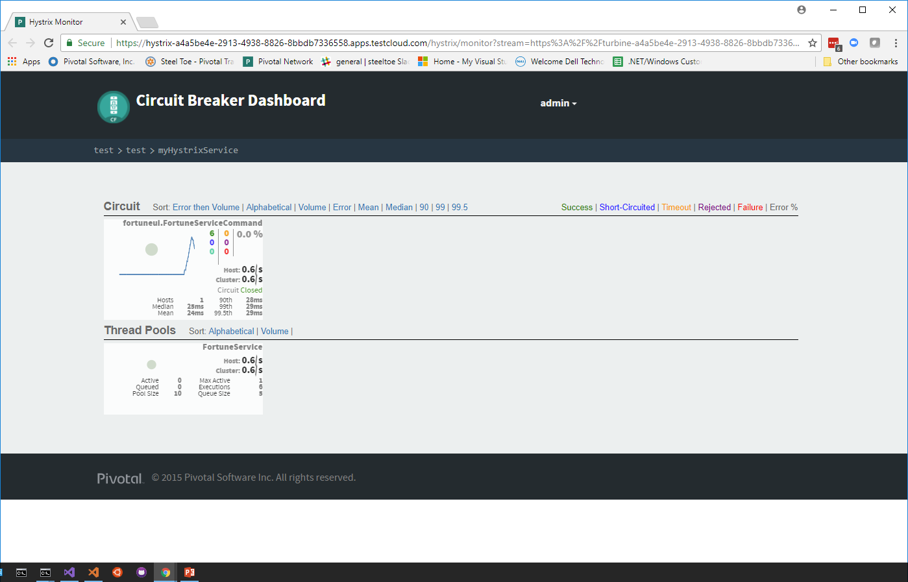

# Lab 9 - Fault Tolerance & Monitoring

>In this lab we will continue to add functionality to the Fortune Teller application. We will learn how to add some level of fault tolerance to the UI portion of our application, along with the ability to see when these faults begin to happen.

>After completing Lab 8, the app in its current state is as follows:

* The application can now scale horizontally.
* Unfortunately, if the Fortune Service becomes unavailable, the UI returns meaningless information to our users and we are unaware of the fact.

>The goals for Lab 9 are to:

* Change `Fortune Teller UI` to use a `Netflix Hystrix Command` to wrap `Fortune Teller Service` REST requests. We will implement a fallback function that handles request failures.
* Change `Fortune Teller UI` to report command metrics/status to the Hystrix dashboard so we can "see" what is happening with all of the requests.

>For some background information on `Netflix Hystrix`, have a look at this [documentation](https://github.com/Netflix/Hystrix/wiki)

## Preparation

### Step 01 - Run Config Server Locally

We are still using the Config Server, so we make sure it is running locally so its easier to develop and test with.

1. Open a command window and change directory to _Workshop/ConfigServer_

   ```bash
   > cd Workshop/ConfigServer
   ```

1. Startup the Config Server

   ```bash
   > mvnw spring-boot:run
   ```

   It will start up on port 8888 and serve configuration data from `Workshop/ConfigServer/steeltoe/config-repo`.

### Step 02 - Run Eureka Server Locally

Here we do the steps to setup and run a Eureka Server locally so its easier to develop and test with.

1. Open a command window and change directory to _Workshop/EurekaServer_

   ```bash
   > cd Workshop/EurekaServer
   ```

1. Startup the Eureka Server

   ```bash
   > mvnw spring-boot:run
   ```

It will start up on port 8761 and serve the Eureka API from "/eureka".

## Add Netflix Hystrix Command 

In this section we will be adding code to the `Fortune Teller UI` to use a `FortuneServiceCommand` Hystrix command when making requests of the `Fortune Teller Service`.

### Step 01 - Add Steeltoe Hystrix Nuget

Make changes to your `Fortune Teller UI` project file to include the Steeltoe Hystrix NuGet.

### Step 02 - Create Hystrix Command - `FortuneServiceCommand`

Add an implementation of a `FortuneServiceCommand` that can be used to make requests of the Fortune Service REST endpoint to retrieve a random Fortune. Place this new class in the `Services` folder.

The `FortuneServiceCommand` should make use of the `IFortuneService` to make requests of the REST endpoint that returns random Fortunes.

The command should override and implement the two Hystrix Command methods `RunAsync()` and `RunFallbackAsync()`.

* `RunAsync()` should use the `IFortuneService` to request random Fortunes.
* `RunFallbackAsync()` should implement whatever fallback logic you'd like to execute. (e.g. Return a fixed Fortune)

### Step 03 - Use Hystrix Command in Controller

Make changes to the `FortunesController.cs` to make use a injected `FortuneServiceCommand` instead of the injected `IFortuneService`.

### Step 04 - Add Hystrix Command to Container

Make changes to your `Startup.cs` class to add the `FortuneServiceCommand` to the service container. When you add the command, make sure the command will belong to the Hystrix command group `FortuneService`.

### Step 05 - Run Locally

Run and verify both Fortune-Tellers continue to run as they did before. Run the application either in a command window or within VS2017.
Every thing should work as it did before, but if you don't start the `Fortune Teller Service` you should see that your fallback logic is now executed in the UI.

## Add Hystrix Dashboard

### Step 01 - Add Steeltoe Hystrix Metrics Stream Nuget

Make changes to your `Fortune Teller UI` project file to include the Steeltoe Hystrix Metrics Stream NuGet.

Note that in addition to the Steeltoe Hystrix Metrics Stream NuGet, you will also need to include the RabbitMQ Client NuGet for communicating with the Hystrix dashboard on Cloud Foundry.

### Step 02 - Add Hystrix Metrics Stream to Container

Make changes to your `Startup.cs` class to add the Hystrix Metric Stream to the service container.  Make the changes such that the metrics stream is only activated/started when running in `Production` mode (i.e. on CloudFoundry).

Remember that you will need to make changes to both the `Configure()` and `ConfigureServices()` methods, and don't forget that a Hystrix Request context must be established for each request flowing through the pipeline.

### Step 03 - Run Locally

Run and verify both Fortune-Tellers continue to run as they did before. Run the application either in a command window or within VS2017.
Every thing should work as it did before as you have not activated Hystrix metrics when running in `Development` mode.

### Step 04 - Create Hystrix Dashboard Service Instance

To create an instance of a Hystrix dashboard service in your org/space follow these instructions:

1. Open a command window.

1. Using the command window, create an instance of the Hystrix dashboard on Cloud Foundry.

   ```bash
   > cf create-service p-circuit-breaker-dashboard standard myHystrixService
   ```

1. Wait for the service to become available on Cloud Foundry.

   ```bash
   > cf services
   ```

### Step 05 - Configure Service Binding

You need to configure your `Fortune Teller UI` to bind to the Hystrix service instance you created above.

Open the `manifest.yml` file for the `Fortune Teller UI` and add to the services section the dashboard instance you created above.

### Step 06 - Using Self-Signed Certificates

In some cases you may find that your Cloud Foundry setup has been installed using self-signed certificates. If that is the case, you will likely run into certificate verification errors when communicating with the Hystrix dashboard. If that is the case you can disable certificate validation by adding `hystrix:stream:validate_certificates=false` to your configuration file.

Check with your instructor to see if you need to do this.

### Step 07 - Push to Cloud Foundry

Publish, push and verify the Fortune Teller application still runs on Cloud Foundry.

### Step 08 - Explore Hystrix Dashboard Service in AppsManager

Note that you will have to use the UI in order to see activity in the dashboard.

1. Open and Login to Pivotal AppsManager in a browser.

1. Select your Org and Space and view the two Fortune Teller applications.

    ---

    

   ---

1. Select the services tab and select Circuit Breaker service instance.

    ---

    

   ---

1. Select the Manage link to view the Hystrix dashboard.

    ---

    

   ---

