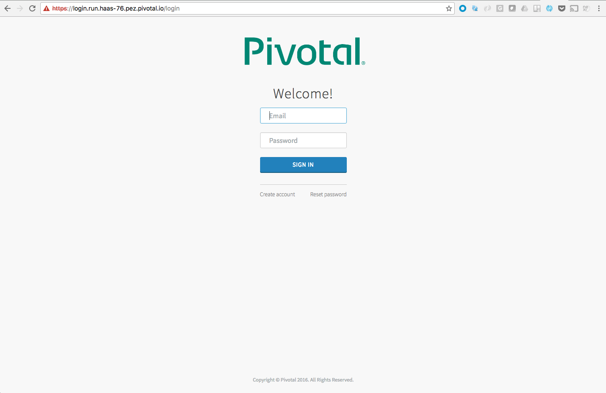
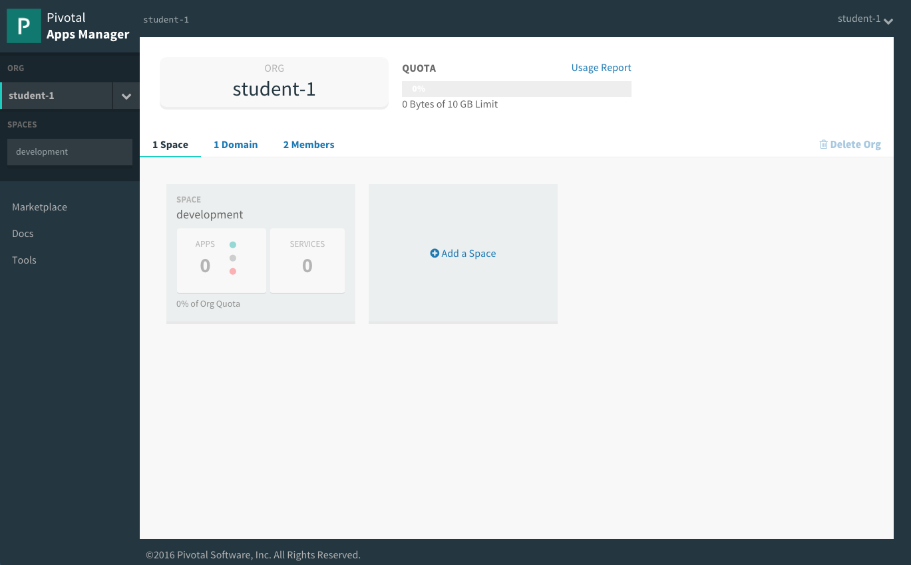

= Lab 0 - Accessing the Workshop Environment

== CF CLI Target and Login

. Download the latest release of the Cloud Foundry CLI from https://github.com/cloudfoundry/cli/releases for your operating system and install it.

. From a command prompt, set the API target for the CLI: (set appropriate end point for your environment)
+
----
> cf api https://api.run.haas-76.pez.pivotal.io --skip-ssl-validation
----

. Login to Pivotal Cloud Foundry (use information from your instructor to log on to Pivotal Cloud Foundry):
+
----
> cf login
----
+
Follow the prompts, choosing the (student-X) username assigned to you by the instructor (password is keepitsimple).
+
====
----
> cf login
API endpoint: https://api.run.haas-76.pez.pivotal.io

Email> student-1

Password>
Authenticating...
OK

Targeted org student-1

Targeted space development

API endpoint:   https://api.run.haas-76.pez.pivotal.io (API version: 2.54.0)
User:           student-1
Org:            student-1
Space:          development

----
====

== AppsManager Login

. Login to Apps Manager URL: https://apps.run.haas-76.pez.pivotal.io. Use the same username and password you entered when using the CF CLI
+
  
  
+

