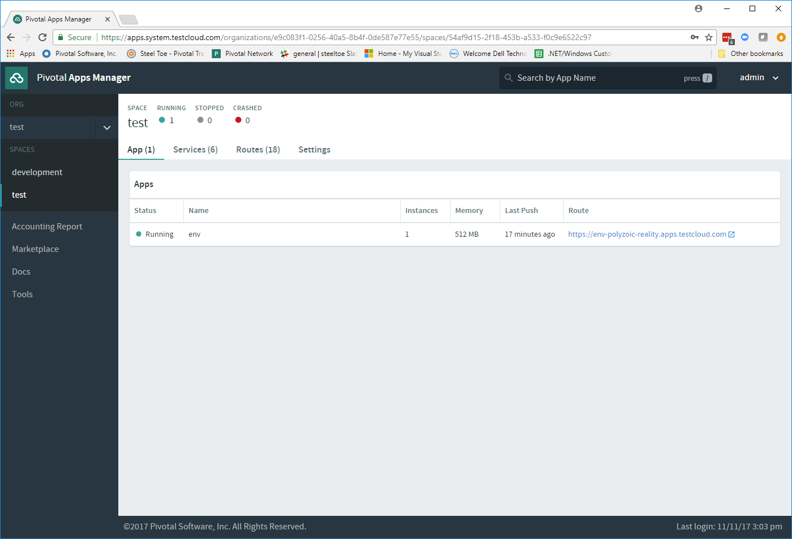
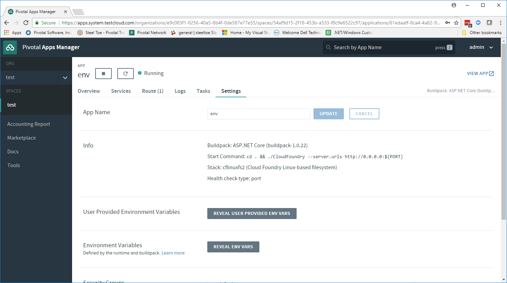
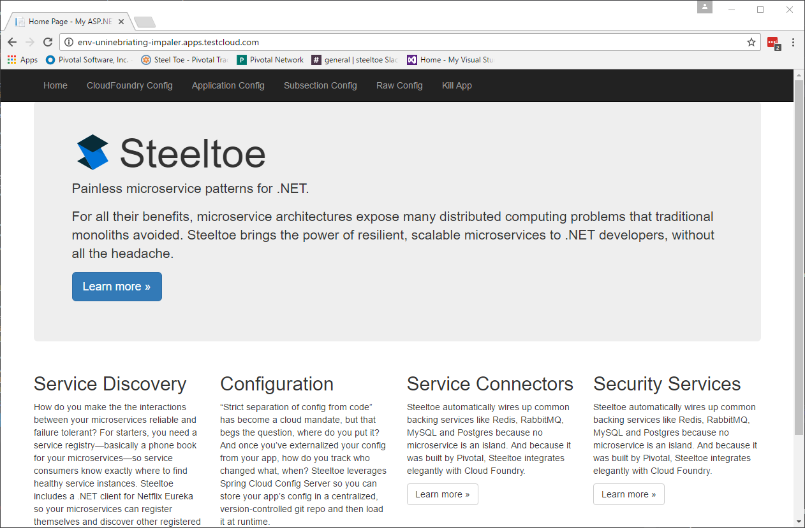
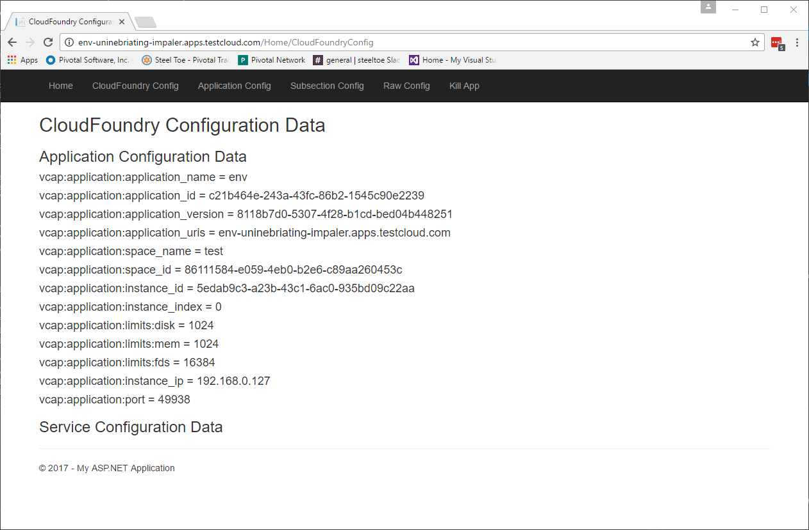
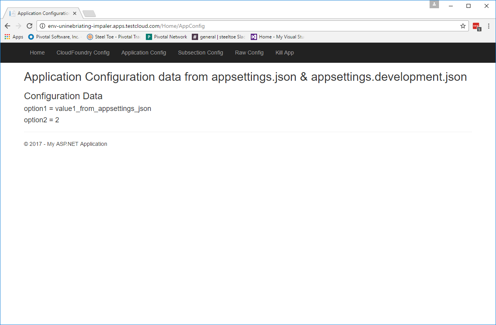
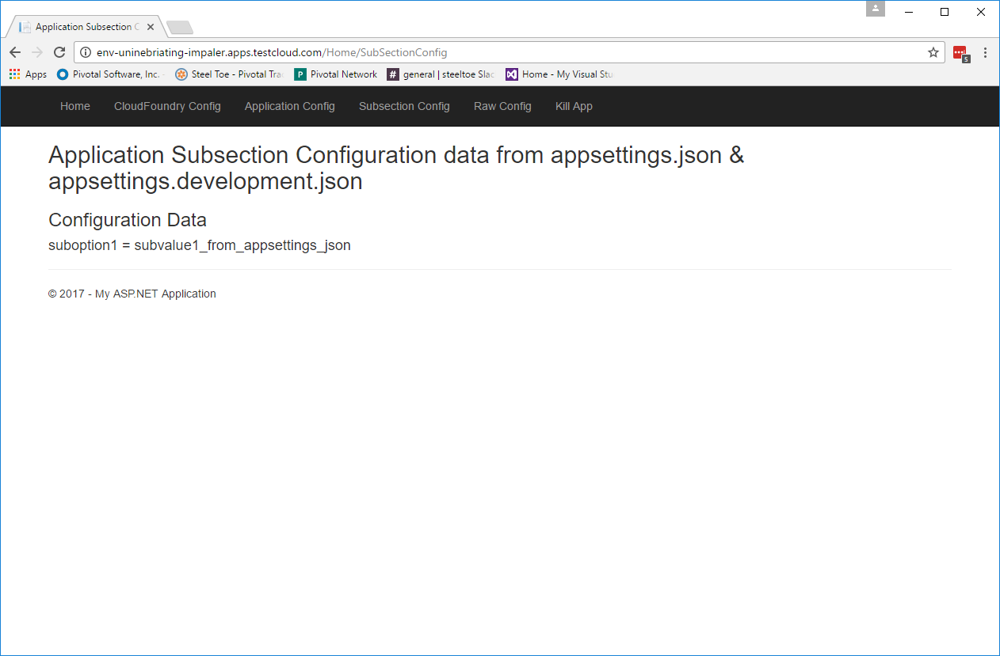
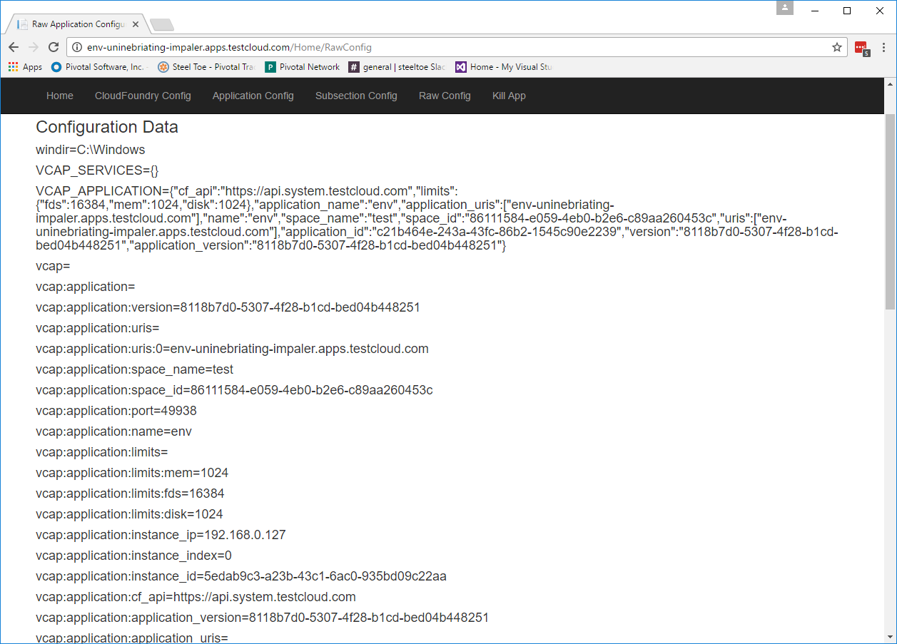

= Lab 1 - Pushing Your First ASP.NET 4.5 Application

[abstract]
--
In this lab we will push a pre-built ASP.NET 4.5 MVC application to Cloud Foundry. The application makes use of the Steeltoe CloudFoundry Configuration provider to parse the configuration data and make it available to the application as configurtaion data.

Note: We will use this same application for all of the rest of the labs in this section of the workshop (i.e. labs1-4).
--

== The App
This is the first application we will look at that is leveraging Steeltoe.

This application was created using the out of the box ASP.NET 4 Web Application template found in Visual Studio 2015. It makes use of the Steeltoe Configuration provider called https://github.com/SteeltoeOSS/Configuration/tree/master/src/Steeltoe.Extensions.Configuration.CloudFoundry[CloudFoundry]. This provider enables the CloudFoundry environment variables, `VCAP_APPLICATION`, `VCAP_SERVICES` and `CF_*` to be parsed and accessed as configuration data within a .NET application.

When Microsoft developed ASP.NET Core, the next generation of ASP.NET, they created a number of new `Extension` frameworks that provide services(e.g. Configuration, Logging, Dependency Injection, etc) commonly used/needed when building applications. While these `Extensions` certainly can be used in ASP.NET Core apps, they can also be leveraged in other app types including ASP.NET 4, Console Apps, UWP Apps, etc. With Steeltoe, we have added to the Microsoft https://github.com/aspnet/Configuration[Configuration Extension providers] by adding two additional providers:

. https://github.com/SteeltoeOSS/Configuration/tree/master/src/Steeltoe.Extensions.Configuration.CloudFoundry[CloudFoundry] Configuration provider
. https://github.com/SteeltoeOSS/Configuration/tree/master/src/Steeltoe.Extensions.Configuration.ConfigServer[Config Server Client] Configuration provider

To get a better understanding of the `Microsoft Configuration Extensions` have a look at the https://docs.microsoft.com/en-us/aspnet/core/fundamentals/configuration[ASP.NET Core Documentation].

As you might expect, all most all of Steeltoe components make use of the CloudFoundry configuration provider in one way or another.

Later on in the workshop we will take a closer look at the `Configuration Extensions`  and the `Steeltoe CloudFoundry Configuration provider`.

== Download code

. If you haven't already done so, download or clone the git repo using the command below. If you don't have git installed, you can click 'Download ZIP' on the right side of the page https://github.com/SteeltoeOSS/Workshop[here].
+
----
> git clone https://github.com/SteeltoeOSS/Workshop
----

== Target

. If you haven't already, set the API target for the CLI: (set appropriate end point for your environment)
+
----
> cf api https://api.run.haas-76.pez.pivotal.io --skip-ssl-validation
----
and login to Pivotal Cloud Foundry:
+
----
> cf login
----
+
Follow the prompts. 

== Publish and Push It!
. Start Visual Studio 2015 and open the solution _Workshop/Session-01/Lab01.sln_
. Right click on a project and right click on CloudFoundry within the lab and select publish
. Publish the application. A CloudFoundry publish profile has already been setup and can be used to publish to the directory _C:/publish_
. Change to the publish directory, _C:/publish_.(this is the default folder the publish profile uses):
+
----
> cd C:/publish
----

. Push the application!
+
----
> cf push
----
+
You should see output similar to the following listing. Take a look at the listing callouts for a play-by-play of what's happening:
+
====
----
c:\publish>cf push
Using manifest file c:\publish\manifest.yml

Using stack windows2012R2...
OK
Creating app env in org test / space test as admin...
OK

Creating route env-uninebriating-impaler.apps.testcloud.com...
OK

Binding env-uninebriating-impaler.apps.testcloud.com to env...
OK

Uploading env...
Uploading app files from: C:\publish
Uploading 797K, 95 files
Done uploading
OK

Starting app env in org test / space test as admin...

1 of 1 instances running

App started

OK

App env was started using this command `..\tmp\lifecycle\WebAppServer.exe`

Showing health and status for app env in org test / space test as admin...
OK

requested state: started
instances: 1/1
usage: 1G x 1 instances
urls: env-uninebriating-impaler.apps.testcloud.com
last uploaded: Fri Jan 13 13:43:48 UTC 2017
stack: windows2012R2
buildpack: windows

     state     since                    cpu    memory    disk      details
#0   running   2017-01-13 06:44:25 AM   0.0%   0 of 1G   0 of 1G

c:\publish>

----
<1> The CLI is using a manifest to provide necessary configuration details such as application name, memory to be allocated, the stack to be used (in this case Windows2012R2), the number of instances requested to start, and path to the application artifact.
In Visual Studio, take a look at `manifest.yml` to see how.
<2> In most cases, the CLI indicates each Cloud Foundry API call as it happens.
In this case, the CLI has created an application record for _env_ in your assigned space.
<3> All HTTP/HTTPS requests to applications will flow through Cloud Foundry's front-end router called https://docs.pivotal.io/pivotalcf/1-7/concepts/architecture/router.html[(Go)Router].
Here the CLI is creating a route with random word tokens inserted (again, see `manifest.yml` for a hint!) to prevent route collisions across the default `apps.testcloud.com` domain.
<4> Now the CLI is _binding_ the created route to the application.
Routes can actually be bound to multiple applications to support techniques such as https://docs.pivotal.io/pivotalcf/1-7/devguide/deploy-apps/blue-green.html[blue-green deployments].
<5> The CLI finally uploads the application bits to Pivotal Cloud Foundry. Notice that it's uploading _39 files_! This is because Cloud Foundry actually uploads all the files for the deployment for caching purposes.
<6> Now we begin the staging process. By choosing the Windows2012R2 stack a container is created on the runtime to prepare the application to run, a second container is then generated that will host your application...in this case using the WebAppServer process in Windows.  If you want to try with other languages you can push an application on the Linux stack.
<7> The complete package of your application and all of its necessary runtime components is called a _droplet_.
Here the droplet is being uploaded to Pivotal Cloudfoundry's internal blobstore so that it can be easily copied to one or more Cells in the _https://docs.pivotal.io/pivotalcf/1-7/concepts/diego/diego-architecture.html[Diego Architecture]_ for execution.
<8> The CLI tells you exactly what command and argument set was used to start your application.
<9> Finally the CLI reports the current status of your application's health.
====

== View the App in AppsManager
. Open AppManager and select your org and space:
+

{sp}+
. Select the ``env`` application and then select the ``Env Variables`` tab.
+

{sp}+
Notice the environment variables ``VCAP_APPLICATION`` and ``VCAP_SERVICES``. These are assigned by CloudFoundry and are meant to provide configuration data for the application:
+
----
Environment Variables:
{
  "staging_env_json": {},
  "running_env_json": {},
  "environment_json": "invalid_key",
  "system_env_json": {
    "VCAP_SERVICES": {}
  },
  "application_env_json": {
    "VCAP_APPLICATION": {
      "cf_api": "https://api.system.testcloud.com",
      "limits": {
        "fds": 16384,
        "mem": 1024,
        "disk": 1024
      },
      "application_name": "env",
      "application_uris": [
        "env-uninebriating-impaler.apps.testcloud.com"
      ],
      "name": "env",
      "space_name": "test",
      "space_id": "86111584-e059-4eb0-b2e6-c89aa260453c",
      "uris": [
        "env-uninebriating-impaler.apps.testcloud.com"
      ],
      "users": null,
      "application_id": "c21b464e-243a-43fc-86b2-1545c90e2239",
      "version": "e5f8aff9-4434-4f54-a4c4-c84569c3d8b3",
      "application_version": "e5f8aff9-4434-4f54-a4c4-c84569c3d8b3"
    }
  }
}
----

You will see in a bit that the Steeltoe CloudFoundry Configuration provider parses this information and makes if available as configuration data to the application.

== Interact with the App

. Visit the application in your browser by hitting the route that was generated by the CLI:
+

{sp}+
. Click on the `CloudFoundry Config` menu item:
+

{sp}+
What you are seeing here is the configuration information from ``VCAP_APPLICATION`` and ``VCAP_SERVICES``.
Take some time and see if you can find in the code how this is accomplished.
Start with the ``CloudFoundryConfig()`` action in the ``HomeController``.

. Click on the `Application Config` menu item:
+

{sp}+
What you are seeing here is the configuration information from ``appsettings.json`` and ``appsettings-development.json``, both configuration files found in the Visual Studio solution.
Take some time and see if you can find in the code how this is accomplished.
Start with the ``AppConfig()`` action in the ``HomeController``.
. Click on the `Subsection Config` menu item:
+

{sp}+
What you are seeing here is the configuration information from a  subsection of ``appsettings.json`` and ``appsettings-development.json``.
Take some time and see if you can find in the code how this is accomplished.
Start with the ``SubSectionConfig()`` action in the ``HomeController``.

. Click on the `Raw Config` menu item:
+

{sp}+
What you are seeing here is the raw listing of all the configuration information available to the application.
Take some time and see if you can find in the code how this is accomplished.
Start with the ``RawConfig()`` action in the ``HomeController``.

. To get an understanding on how the configurtion for the app is created from all the different sources have a look at the ``AppConfig`` class in the ``App_Start`` folder and the static method ``BuildConfiguration()` method.
See if you can figure out how Steeltoe is used to add to the Configuration.  In later labs we will explore this in more depth.

== Interact with App from CF CLI

. Get information about the currently deployed application using CLI apps command:
+
----
> cf apps
----
+
Note the application name for next steps

. Get information about running instances, memory, CPU, and other statistics using CLI instances command
+
----
> cf app env
----

. Stop the deployed application using the CLI
+
----
> cf stop env
----

. Delete the deployed application using the CLI
+
----
> cf delete env
----