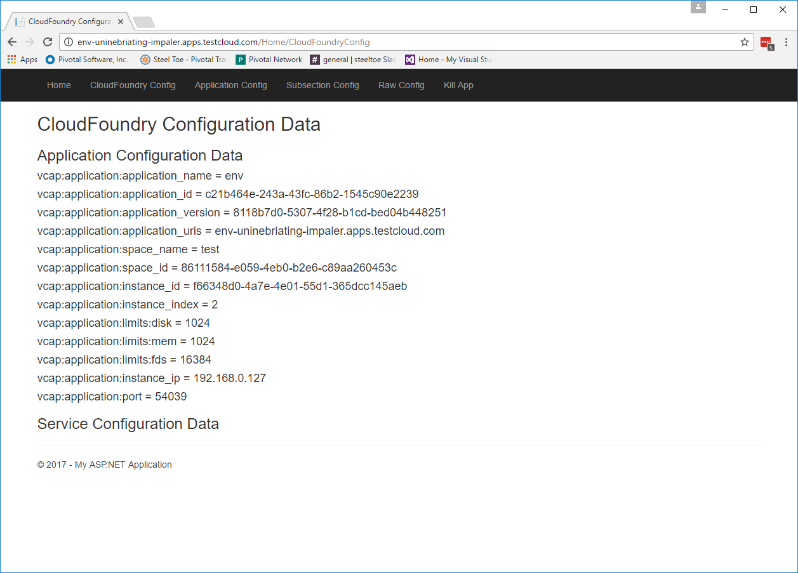
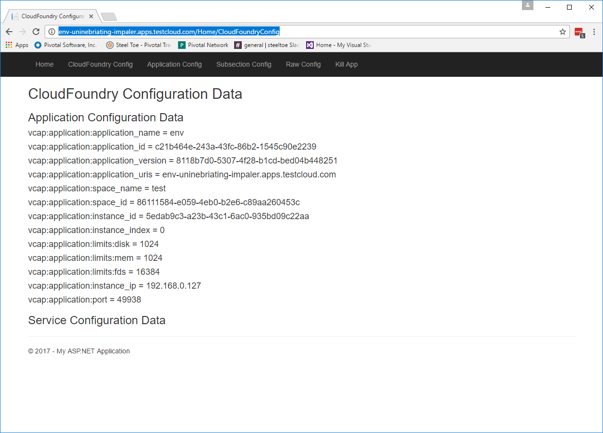
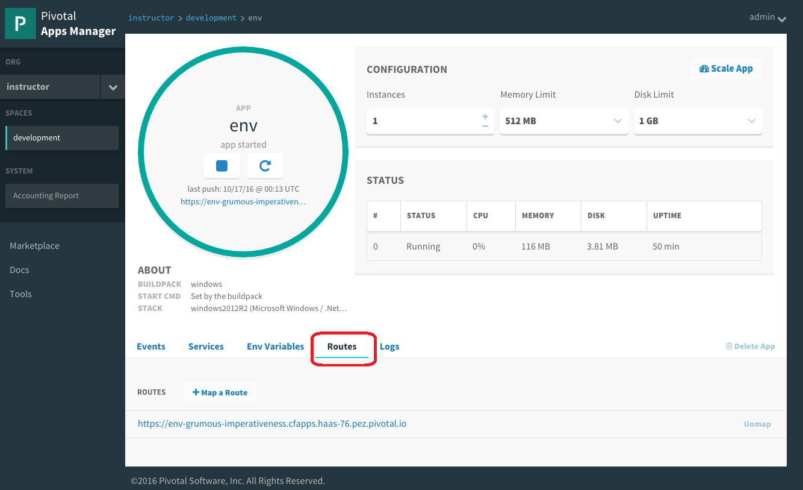
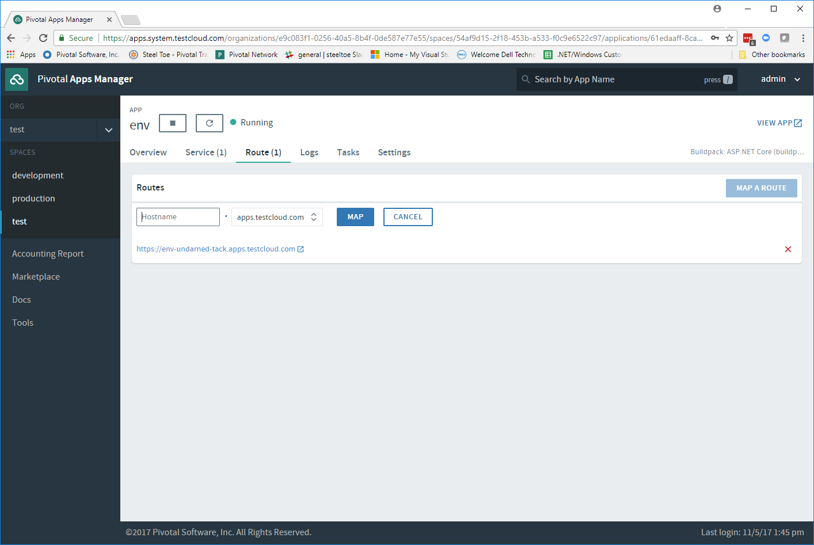
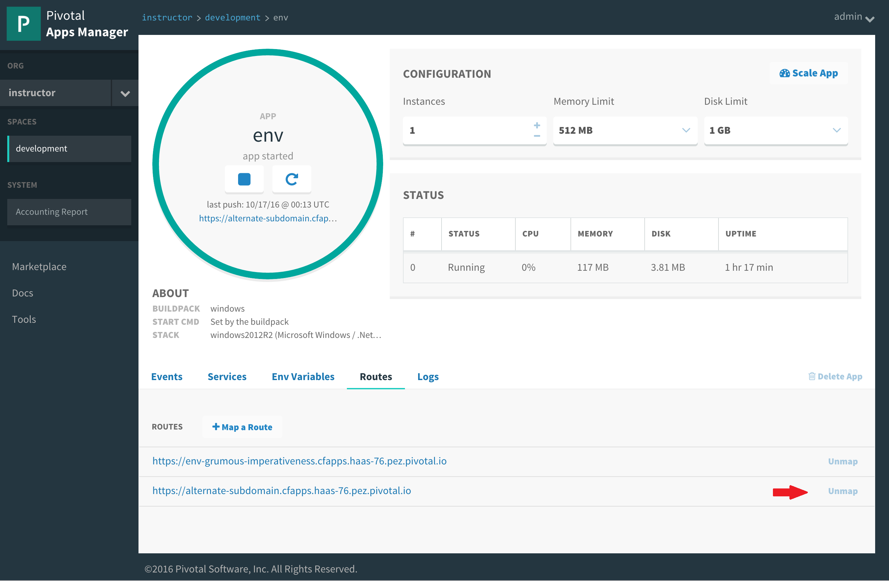
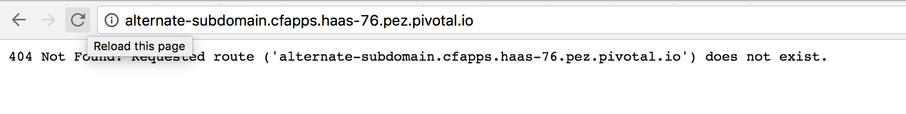

= Lab 3 - Scaling and Operating Applications

[abstract]
--
Pivotal Cloudfoundry makes the work of performing actions, such as scaling, doing a zero-downtime deploy, and managing application health very easy.
In the next two labs we'll explore Pivotal Cloud Foundry operations.
--

== Scale the Application Up

. Now let's increase the number of running application instances to 3.  :
+
----
> cf scale env -i 3
Scaling app env in org instructor / space development as admin...
OK

----
+
In reporting `OK`, the CLI is letting you know that the additional requested instances have been started, but they are not yet necessarily running.

. We can determine how many instances are actually running like this:
+
====
----
> cf app env
Showing health and status for app env in org instructor / space development as admin...
OK

requested state: started
instances: 3/3
usage: 512M x 3 instances
urls: env-grumous-imperativeness.cfapps.haas-76.pez.pivotal.io
last uploaded: Mon Oct 17 00:13:08 UTC 2016
stack: windows2012R2
buildpack: binary_buildpack

     state      since                    cpu    memory           disk         details
#0   running    2016-10-16 08:37:52 PM   0.2%   113.4M of 512M   3.8M of 1G
#1   starting   2016-10-16 08:53:26 PM   0.2%   110.2M of 512M   3.8M of 1G
#2   starting   2016-10-16 08:53:26 PM   0.2%   111.6M of 512M   3.8M of 1G
>
----
<1> This application instance has completed the startup process and is actually able to accept requests.
<2> This application instance is still starting and will not have any requests routed to it.
====

. Eventually all instances will converge to a running state:
+
----
> cf app env
Showing health and status for app env in org instructor / space development as admin...
OK

requested state: started
instances: 3/3
usage: 512M x 3 instances
urls: env-grumous-imperativeness.cfapps.haas-76.pez.pivotal.io
last uploaded: Mon Oct 17 00:13:08 UTC 2016
stack: windows2012R2
buildpack: binary_buildpack

     state     since                    cpu    memory           disk         details
#0   running   2016-10-16 08:37:52 PM   0.2%   113.4M of 512M   3.8M of 1G
#1   running   2016-10-16 08:52:16 PM   0.0%   110.1M of 512M   3.8M of 1G
#2   running   2016-10-16 08:52:17 PM   0.0%   111.5M of 512M   3.8M of 1G

----

. Revisit the application route in the browser and select the CloudFoundry Config menu item.
Refresh several times.
You should observe the instance index changing as you do so:
+

{sp}+
{sp}+
The aforementioned https://docs.pivotal.io/pivotalcf/1-7/concepts/architecture/router.html[(Go)Router] is applying a random routing algorithm to all of the application instances assigned to this route.
As an instance reaches the `running` state, its https://docs.pivotal.io/pivotalcf/1-8/concepts/diego/diego-architecture.html#architecture[Diego] Cell registers that instance in the routing table assigned to its route by sending a message to Cloud Foundry's message bus.
All (Go)Router instances are subscribed to this channel and register the routes independently.
This makes for very dynamic and rapid reconfiguration!

== Scale the Application Down

. We can scale the application instances back down as easily as we scaled them up, using the same command structure:
+
----
> cf scale env -i 1
Scaling app env in org instructor / space development as admin...
OK

----

. Check the application status again:
+
----
> cf app env
Showing health and status for app env in org instructor / space development as admin...
OK

requested state: started
instances: 1/1
usage: 512M x 1 instances
urls: env-grumous-imperativeness.cfapps.haas-76.pez.pivotal.io
last uploaded: Mon Oct 17 00:13:08 UTC 2016
stack: windows2012R2
buildpack: binary_buildpack

     state     since                    cpu    memory           disk         details
#0   running   2016-10-16 08:37:52 PM   0.0%   113.8M of 512M   3.8M of 1G

----
+
As you can see, we're back down to only one instance running, and it is in fact the original index 0 that we started with.

. Confirm that by again revisiting the route in the browser and checking the instance index:
+

== HTTP Routing

There are two ways to discover what routes, or HTTP URLs, are ampped to an application
The first is available via the CLI. Just type:

----
> cf app env
Showing health and status for app env in org instructor / space development as admin...
OK

requested state: started
instances: 1/1
usage: 512M x 1 instances
urls: env-grumous-imperativeness.cfapps.haas-76.pez.pivotal.io
last uploaded: Mon Oct 17 00:13:08 UTC 2016
stack: windows2012R2
buildpack: binary_buildpack

     state     since                    cpu    memory           disk         details
#0   running   2016-10-16 08:37:52 PM   0.2%   116.9M of 512M   3.8M of 1G

----

and you'll see the list of routes in the section that says _urls_.

The second way is via the Apps Manager UI.  Click on the _env_ application to view application details.  Select the _Routes_ tab to view a list of mapped routes:

. We can easily add an additional route by clicking on _+ Map a Route_ and supplying the new hostname:
+

. Navigate to the new URL in your browser window.  You should see that same application displayed!

. We can just as easily remove a route by clicking on _Unmap_ on the route you wish to remove.
+

+
If you navigate to that URL you'll receive a HTTP 404 response
+

. This is how blue-green deployments are accomplished. Check the https://docs.pivotal.io/pivotalcf/1-7/devguide/deploy-apps/blue-green.html[documentation] for detaild instructions.
+
image::../../Common/images/blue-green.png[]

