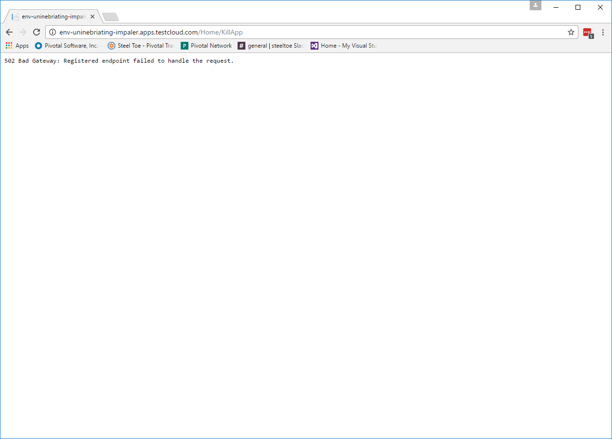
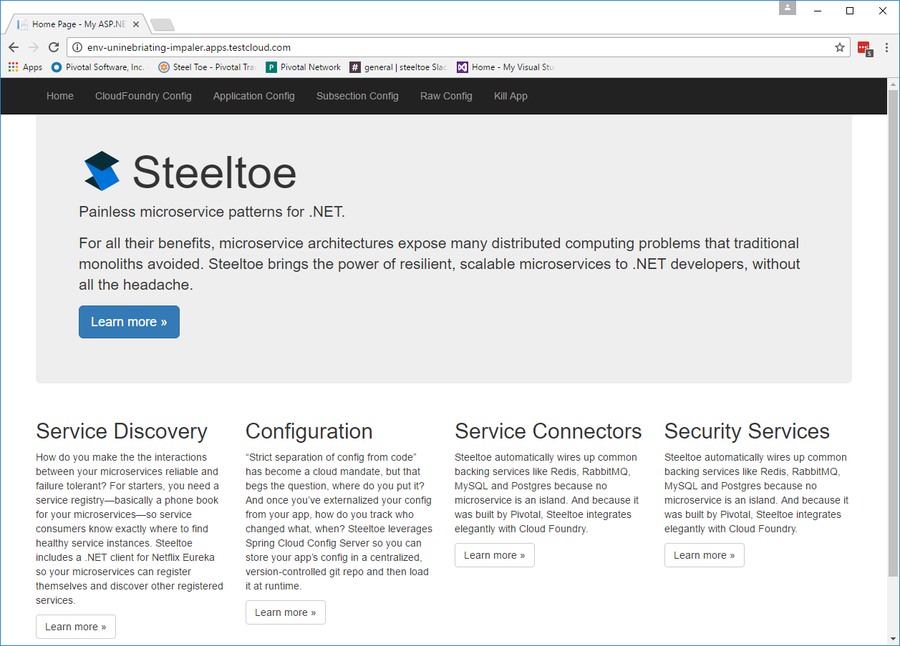
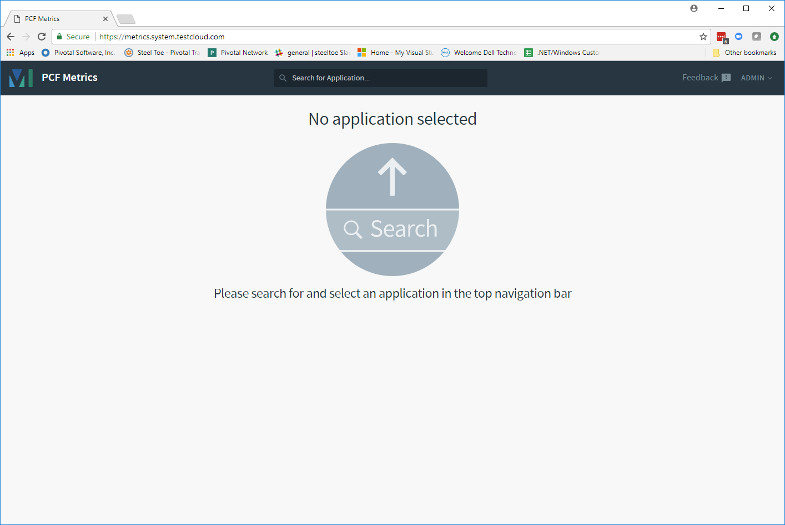
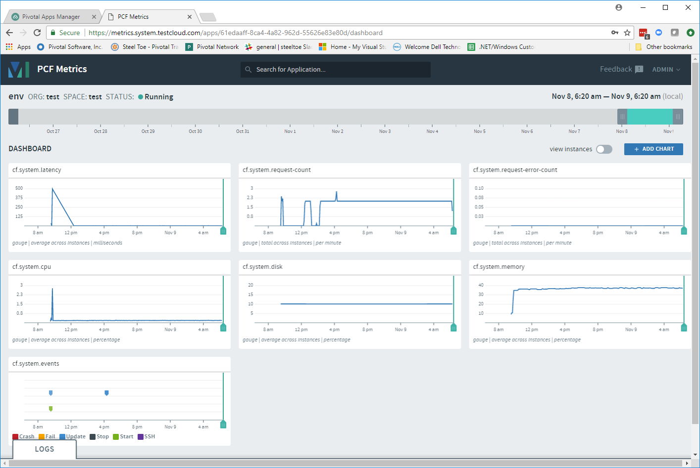

= Lab 4 - Monitoring Applications

[abstract]
--
Pivotal Cloud Foundry makes the work of performing actions, such as managing logs, doing a zero-downtime deploy, and managing application health very easy.
In this lab we'll explore some of these capabilities.
--

== Tailing Application Logs

One of the most important enablers of visibility into application behavior is logging.
Effective management of logs has historically been difficult or required wiring into third party tools.
Cloud Foundry's https://docs.pivotal.io/pivotalcf/1-7/loggregator/architecture.html[log aggregation] components simplify log management by assuming responsibility for it.
Application developers need only log all messages to either 'Console.Write' in .NET or  `STDOUT` or `STDERR` in other languages, and the platform will capture these messages.

=== For Developers

Application developers can view application logs using the CF CLI.

. Let's view recent log messages for the application.
+
----
> cf logs env --recent
----
+
Here are two interesting subsets of one output from that command:
+
.CF Component Logs
====
----
> cf logs env --recent
Connected, dumping recent logs for app env in org instructor / space development as admin...
2016-10-16T20:51:06.59-0400 [CELL/1]     OUT Creating container
2016-10-16T20:51:07.18-0400 [CELL/1]     OUT Successfully created container
2016-10-16T20:51:07.59-0400 [CELL/1]     OUT Starting health monitoring of container
2016-10-16T20:51:11.11-0400 [APP/1]      OUT PORT == 51721
2016-10-16T20:51:11.11-0400 [APP/1]      OUT Running ..\tmp\lifecycle\WebAppServer.exe
2016-10-16T20:51:11.11-0400 [APP/1]      OUT 2016-10-17 00:51:08Z|INFO|Port:51721
2016-10-16T20:51:11.11-0400 [APP/1]      OUT 2016-10-17 00:51:08Z|INFO|Webroot:c:\containerizer\034C916AB3FD51DA35\user\app
2016-10-16T20:51:11.11-0400 [APP/1]      OUT 2016-10-17 00:51:08Z|INFO|Starting web server instance...
2016-10-16T20:51:11.11-0400 [APP/1]      OUT Checking DB structure.
2016-10-16T20:51:11.11-0400 [APP/1]      OUT Server Started.... press CTRL + C to stop
2016-10-16T20:51:11.62-0400 [CELL/1]     OUT Container became healthy
2016-10-16T20:52:11.63-0400 [API/0]      OUT Updated app with guid e59bfcea-1a35-4b5f-ae84-2d7c78e13976 ({"instances"=>3})
2016-10-16T20:54:11.63-0400 [RTR/0]      OUT env-grumous-imperativeness.cfapps.haas-76.pez.pivotal.io - [17/10/2016:00:54:11.128 +0000] "GET / HTTP/1.1" 200 0 8376 "http://env-grumous-imperativeness.cfapps.haas-76.pez.pivotal.io/" "Mozilla/5.0 (Macintosh; Intel Mac OS X 10_11_1) AppleWebKit/537.36 (KHTML, like Gecko) Chrome/53.0.2785.116 Safari/537.36" 10.193.145.250:44800 x_forwarded_for:"10.193.145.1" x_forwarded_proto:"http" vcap_request_id:60153894-cfdc-444d-7e0f-77faa17d01fb response_time:0.006277964 app_id:e59bfcea-1a35-4b5f-ae84-2d7c78e13976
----
<1> An ``Apache-style'' access log event from the (Go)Router
<2> An API log event that corresponds to an event as shown in `cf events`
<3> A CELL log event indicating the start of an application instance on that CELL.
====
+
.Application Logs
====
----
2016-10-16T22:58:29.70-0400 [APP/0]      OUT Kaboom.
2016-10-16T22:58:29.72-0400 [APP/0]      OUT Exit status -1
----
====
+
As you can see, Cloud Foundry's log aggregation components capture both application logs and CF component logs relevant to your application.
These events are properly interleaved based on time, giving you an accurate picture of events as they transpired across the system.  In this case we output Kaboom when the `Kill App` menu item is pressed in the .NET app

. To get a running ``tail`` of the application logs rather than a dump, simply type:
+
----
> cf logs env
----
+
You can try various things like refreshing the browser and triggering stop/start events to see logs being generated.

== Health Management

Cloud Foundry's https://docs.pivotal.io/pivotalcf/1-7/concepts/architecture/#nsync-bbs[components] actively monitors the health of our application processes and will restart them should they crash.

. If you don't have one already running, start a log tail for `env`.
+
----
> cf logs env
----

. If you do not have more than one application instance running, execute the scale command to scale to 2 or more application instances.  Visit the application in the browser, and click on the ``Kill App`` menu item. This menu item will trigger an Environment.Exit(-1) causing the Health Manager to observe an application instance crash:
+

. After clicking the ``Kill App`` menu item a couple of interesting things should happen.
First, you'll see an error code returned in the browser, as the request you submitted never returns a response:
+

+
Also, if you're paying attention to the log tail, you'll see some interesting log messages fly by:
+
====
----
2016-10-16T22:56:22.22-0400 [API/0]      OUT App instance exited with guid e59bfcea-1a35-4b5f-ae84-2d7c78e13976 payload: {"instance"=>"8fb02068-684d-48c5-42b1-c0b800c57b4d", "index"=>0, "reason"=>"CRASHED", "exit_description"=>"2 error(s) occurred:\n\n* 2 error(s) occurred:\n\n* Exited with status -1\n* cancelled\n* 1 error(s) occurred:\n\n* cancelled", "crash_count"=>1, "crash_timestamp"=>1476672982202265440, "version"=>"796dc91d-af0a-4784-8fb4-2c88448c4ad3"}
2016-10-16T22:56:22.75-0400 [API/0]      OUT Updated app with guid e59bfcea-1a35-4b5f-ae84-2d7c78e13976 
2016-10-16T22:58:29.70-0400 [APP/0]      OUT Kaboom.
2016-10-16T22:58:29.72-0400 [APP/0]      OUT Exit status -1
2016-10-16T22:58:29.84-0400 [CELL/0]     OUT Exit status -26
----
<1> Just before issuing the `Environment.Exit(-1)` call, the application logs that the kill switch was clicked.
<2> The (Go)Router logs the 502 error.
<3> The API logs that an application instance exited due to a crash.
====

. Wait a few seconds...  By this time you should have noticed some additional interesting events in the logs:
+
====
----
2016-10-16T22:58:29.87-0400 [CELL/0]     OUT Creating container
2016-10-16T22:58:30.37-0400 [CELL/0]     OUT Successfully created container
2016-10-16T22:58:30.78-0400 [CELL/0]     OUT Starting health monitoring of container
2016-10-16T22:58:30.91-0400 [APP/0]      OUT Running ..\tmp\lifecycle\WebAppServer.exe
2016-10-16T22:58:30.92-0400 [APP/0]      OUT PORT == 58849
2016-10-16T22:58:30.93-0400 [APP/0]      OUT 2016-10-17 02:58:30Z|INFO|Port:58849
2016-10-16T22:58:30.93-0400 [APP/0]      OUT 2016-10-17 02:58:30Z|INFO|Webroot:c:\containerizer\C2AB9FCE9A99DA8757\user\app
2016-10-16T22:58:30.94-0400 [APP/0]      OUT 2016-10-17 02:58:30Z|INFO|Starting web server instance...
2016-10-16T22:58:30.98-0400 [APP/0]      OUT Server Started.... press CTRL + C to stop
2016-10-16T22:58:33.95-0400 [CELL/0]     OUT Container became healthy
----
<1> The CELL indicates that it is starting another instance of the application as a result of the Health Manager observing a difference between the desired and actual state (i.e. running instances = 1 vs. running instances = 0).
<2> The new application instance starts logging events as it starts up.
====

. Revisiting the *HOME PAGE* of the application and you should see a fresh instance started:
+

== Viewing Application _Events_

Cloud Foundry only allows application configuration to be modified via its API.
This gives application operators confidence that all changes to application configuration are known and auditable.
It also reduces the number of causes that must be considered when problems arise.

All application configuration changes are recorded as _events_.
These events can be viewed via the Cloud Foundry API, and viewing is facilitated via the CLI.

Take a look at the events that have transpired so far for our deployment of `workshop`:

====
----
> cf events env
Getting events for app env in org instructor / space development as admin...

time                          event                   actor   description
2016-10-16T22:59:33.00-0400   app.crash               env     index: 0, reason: CRASHED, exit_description: 2 error(s) occurred:

                                                              * 2 error(s) occurred:

                                                              * Exited with status -1
                                                              * cancelled
                                                              * cancelled
2016-10-16T22:56:23.00-0400   audit.app.update        admin   state: STARTED
2016-10-16T22:56:22.00-0400   audit.app.update        admin   state: STOPPED
2016-10-16T22:54:27.00-0400   audit.app.update        admin   instances: 2
2016-10-16T21:56:13.00-0400   audit.app.update        admin
2016-10-16T21:56:13.00-0400   audit.app.unmap-route   admin
2016-10-16T21:51:52.00-0400   audit.app.update        admin
2016-10-16T21:51:52.00-0400   audit.app.map-route     admin
2016-10-16T21:03:22.00-0400   audit.app.update        admin   instances: 1
2016-10-16T20:53:26.00-0400   audit.app.update        admin   instances: 3
2016-10-16T20:53:18.00-0400   audit.app.update        admin   instances: 1
2016-10-16T20:52:10.00-0400   audit.app.update        admin   instances: 3
2016-10-16T20:37:46.00-0400   audit.app.update        admin   state: STARTED
2016-10-16T20:37:46.00-0400   audit.app.update        admin   state: STOPPED
2016-10-16T20:13:09.00-0400   audit.app.update        admin   state: STARTED
2016-10-16T20:13:06.00-0400   audit.app.update        admin
2016-10-16T20:13:06.00-0400   audit.app.map-route     admin
2016-10-16T20:13:04.00-0400   audit.app.create        admin   instances: 1, memory: 512, state: STOPPED, environment_json: PRIVATE DATA HIDDEN

----
<1> Events are sorted newest to oldest, so we'll start from the bottom.
Here we see the `app.create` event, which created our application's record and stored all of its metadata (e.g. `memory: 512`).
<2> The `app.map-route` event records the incoming request to assign a route to our application.
<3> An `app.update` event records the resulting change to our applications metadata.
<4> An `app.update` event records the change of our application's state to `STARTED`.
<5> Remember scaling the application up? An `app.update` event records the metadata change `instances: 2`.
<6> Also there's the `app.crash` event recording that we encountered a crash of an application instance.
====

. Let's explicitly ask for the application to be stopped:
+
----
> cf stop env
Stopping app env in org instructor / space development as admin...
OK

----

. Now, examine the additional `app.update` event:
+
----
> cf events env
Getting events for app env in org instructor / space development as admin...

time                          event                   actor   description
2016-10-16T23:11:21.00-0400   audit.app.update        admin   state: STOPPED
2016-10-16T22:59:33.00-0400   app.crash               env     index: 0, reason: CRASHED, exit_description: 2 error(s) occurred:

                                                              * 2 error(s) occurred:

                                                              * Exited with status -1
                                                              * cancelled
                                                              * cancelled

----

. Start the application again:
+
----
> cf start env
Starting app env in org instructor / space development as admin...

0 of 2 instances running, 2 starting
2 of 2 instances running

App started

OK

App env was started using this command `..\tmp\lifecycle\WebAppServer.exe`

Showing health and status for app env in org instructor / space development as admin...
OK

requested state: started
instances: 2/2
usage: 512M x 2 instances
urls: env-grumous-imperativeness.cfapps.haas-76.pez.pivotal.io
last uploaded: Mon Oct 17 00:13:08 UTC 2016
stack: windows2012R2
buildpack: binary_buildpack

     state     since                    cpu    memory           disk         details
#0   running   2016-10-16 11:14:20 PM   0.0%   105.2M of 512M   3.8M of 1G
#1   running   2016-10-16 11:14:21 PM   0.0%   105.1M of 512M   3.8M of 1G

----

. And again, view the additional `app.update` event:
+
----
> cf events env
Getting events for app env in org instructor / space development as admin...

time                          event                   actor   description
2016-10-16T23:14:15.00-0400   audit.app.update        admin   state: STARTED
2016-10-16T23:11:21.00-0400   audit.app.update        admin   state: STOPPED
----

== Viewing Application _Metrics_ with PCF Metrics

1. To access PCF Metrics go to this URL in your browser: https://metrics.run.haas-76.pez.pivotal.io  
    a. Accept the authorization request if prompted.
    b. Select the application you want to see metrics from in the selection box
+

+
	c. Explore the container and network metrics and correlate them with your logs!
+

+
    d. For more information about PCF Metrics visit this URL: https://docs.pivotal.io/pcf-metrics/1-1/using.html

