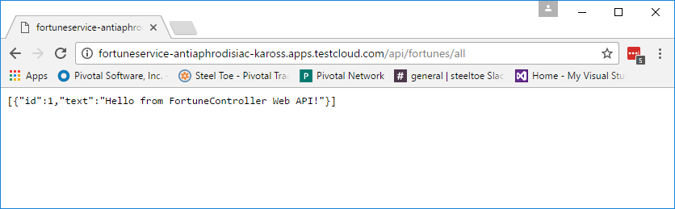

= Lab 5 - Running, Publishing and Deploying ASP.NET Core Micro-services

[abstract]
--
In this lab we will become comfortable with running ASP.NET Core Web applications locally on our PC and publishing and deploying them to Cloud Foundry.

We will be using a ``Fortune Teller`` micro-services based application as our sample.
The app consists of a ``Fortune Teller Service`` which provides a REST API to serve up Fortunes and a ``Fortune Teller UI`` that can be used to display the Fortunes.
In its current state, this app is not fully functional.
The ``Fortune Teller Service`` only serves up a single Fortune and the ``Fortune Teller UI`` doesn't know how to communicate with the ``Fortune Teller Service`` so it always returns a single ``Hello world`` Fortune.

In this lab we will work with both of them, running them locally and pushing them to Cloud Foundry in their current state.
In future labs we will systematically make the changes necessary to make them a working application.

Note: If you are doing this Lab on a Mac you will need to install Mono. The simple way to do that is to use ``brew``. At a command prompt enter ``brew install mono``. Once complete you will need to export an environment variable in the command window you will be working within in order to work around a problem with the ``dotnet`` tooling.  To do this, you will first need to locate where ``brew`` installed Mono. Then, once you have that determined then you will need to use that information to export the path to the Mono core libraries. Something like this:  ``export FrameworkPathOverride=/usr/local/Cellar/mono/4.8.0.495/lib/mono/4.5/`` will need to be entered.
--

== Open Visual Studio Solution
. Start Visual Studio and open the solution/folder  _Workshop/Session-02/Lab05.sln_
.. Open _Fortune-Teller-Service/Fortune-Teller-Service.csproj_ or  _Fortune-Teller-UI/Fortune-Teller-UI.csproj_.
... Notice the ``TargetFrameworks`` specifies ``netcoreapp1.1`` and ``net462``. This ASP.NET Core app is intended to run on ``.NET Core 1.1`` and ``.NET Framework 4.6.2``.
... Notice the ``PackageReference`` items as they specify all the NuGets the application depends on.
... Notice the ``RuntimeIdentifiers`` specifies what runtimes you can publish this application for.  When targeting .NET Core, this causes the app to be fully self-contained when published. Otherwise without it we get a `portable` app.
.. If your using Visual Studio 2017 you can open the Debug Launch dropdown.
... Notice ``Framework`` selection allows either ``netcoreapp1.1`` or ``net462`` to be selected.
... Notice hosting environment can be ``IIS Express`` or ``Fortune-Teller-Service`` and either can be selected.

== Run Fortune Teller Service in VS2017, on .NET 4.x (Windows only)

. Start Visual Studio 2017 and open the solution _Workshop/Session-02/Lab05.sln_
.. Set ``Fortune-Teller-Service`` as active project (i.e. Select Project->Right Click->Set As Startup project)
.. Select  ``Framework`` to be ``.NET 4.6.2``
.. Select a ``Hosting environment`` to be ``Fortune_Teller_Service``
.. Start application (e.g. CTRL-F5 or F5)
.. Notice command window opens with app running
.. Open browser and hit REST endpoint ``http://localhost:5000/api/fortunes/all``.
.. Try setting breakpoints in the FortunesController if you're running in the debugger.
.. How does port 5000 get selected to be used on startup? Look at ``launchSettings.json``.
.. Stop the app, and change it to run under IIS Express.
.. Notice no command window opens with app running.
.. Use browser to hit the REST endpoint.

== Run Fortune Teller Service in VS2017, on .NET Core (Windows only)

. Start Visual Studio 2017 and open the solution _Workshop/Session-02/Lab05.sln_
.. Set ``Fortune-Teller-Service`` as active project (i.e. Select Project->Right Click->Set As Startup project)
.. Select  ``Framework`` to be ``.NET Core App, 1.1``
.. Select a ``Hosting environment`` to be ``Fortune_Teller_Service``
.. Start application (e.g. CTRL-F5 or F5)
.. Try setting breakpoints in the FortunesController if you're running in the debugger.
.. Notice command window opens with app running
.. Open browser and hit REST endpoint ``http://localhost:5000/api/fortunes/all``.
.. Stop the app, and change it to run under IIS Express.
.. Notice no command window opens with app running.
.. Use browser to hit the REST endpoint.

== Run Fortune Teller UI in VS2017, both on .NET 4.x and .NET Core (Windows only)

Hint: Shutdown Fortune Service before proceeding

. Use the instructions above, but apply them to the Fortune Teller UI.

== Run Fortune Teller Service in Command Window on .NET 4.x (Windows only)

. On Windows make sure the path variable points to bower executable directory. If you have Visual Studio 2017 installed, this should work.

 C:\Program Files (x86)\Microsoft Visual Studio 14.0\Web\External

. Start a command window.
. Change directory to the ``Fortune Teller Service``
+
----
> cd Workshop/Session-02/Lab05/Fortune-Teller-Service
----
. Restore the nuget dependencies for the application
+
----
> dotnet restore
----
. Run the application on .NET 4.x
+
----
> dotnet run -f net462
----
. Hit the REST endpoint ``http://localhost:5000/api/fortunes/all``.
. Examine help for ``dotnet run``
+
----
> dotnet run -h
----

== Run Fortune Teller Service in Command Window on .NET Core
. Start a command window.
. Change directory to the ``Fortune Teller Service``
+
----
> cd Workshop/Session-02/Lab05/Fortune-Teller-Service
----
. Restore the nuget dependencies for the application
+
----
> dotnet restore
----
. Run the application on .NET Core
+
----
> dotnet run -f netcoreapp1.1
----
. Hit the REST endpoint ``http://localhost:5000/api/fortunes/all``.

== Run Fortune Teller UI in Command Window, both on .NET 4.x and .NET Core
. Use the instructions above, but apply them to the Fortune Teller UI.
. Hint: You can specify what port the server listens on as follows:
.. dotnet run -f netcoreapp1.1 --server.urls http://*:5555
.. dotnet run -f net462 --server.urls http://*:5555

== Publish and Push Fortune Teller Service to Cloud Foundry Linux Cell
. Start a command window.
. Change directory to the ``Fortune Teller Service``
+
----
> cd Workshop/Session-02/Lab05/Fortune-Teller-Service
----

. Restore the nuget dependencies for the application
+
----
> dotnet restore
----
. Remove any previously published artifacts if they exist
+

----
> Windows: rmdir /s /q .\publish

> Mac/Linux: rm -rf publish
----
. Publish for Ubuntu and .NET Core,
+
----
> Windows: dotnet publish -f netcoreapp1.1 -r ubuntu.14.04-x64 -o %CD%\publish

> Mac/Linux: dotnet publish -f netcoreapp1.1 -r ubuntu.14.04-x64 -o $PWD/publish
----

. In Visual Studio, examine the `manifest.yml` and `manifest-windows.yml` files.
.. ``manifest.yml`` -> for pushing to Linux cell
.. ``manifest-windows.yml`` -> for pushing to Windows cell
. Push the published app to a Linux cell using ``manifest.yml``.
+
----
> Windows: cf push -f manifest.yml -p .\publish

> Mac/Linux: cf push -f manifest.yml -p publish
----

. Hit the REST endpoint using the route that was generated by the CLI and adding ``/api/fortunes/all`` to it:
+

{sp}+
. Examine help for ``dotnet publish``
+
----
> dotnet publish -h
----

== Publish and Push Fortune Teller UI to Cloud Foundry Linux Cell
. Use the instructions above, but apply them to the Fortune Teller UI.

== Publish for .NET 4 and Push Fortune Teller Service to Cloud Foundry Windows Cell
. Start a command window.
. Change directory to the ``Fortune Teller Service``
+
----
> cd Workshop/Session-02/Lab05/Fortune-Teller-Service
----
. Restore the nuget dependencies for the application
+
----
> dotnet restore
----
. Remove any previously published artifacts if they exist
+
----
> Windows: rmdir /s /q .\publish

> Mac/Linux: rm -rf publish
----
. Publish for Windows and .NET 4.6.2
+
----
> dotnet publish -f net462 -r win10-x64 -o %CD%\publish
----
. In Visual Studio, examine the `manifest.yml` and `manifest-windows.yml` files.
.. ``manifest.yml`` -> for pushing to Linux cell
.. ``manifest-windows.yml`` -> for pushing to Windows cell
. Push the published app to a Windows cell using ``manifest-windows.yml``.
+
----
> cf push -f manifest-windows.yml -p .\publish
----

. Hit the REST endpoint using the route that was generated by the CLI and adding ``/api/fortunes/all`` to it:
+

== Publish for .NET Core and Push Fortune Teller Service to Cloud Foundry Windows Cell
. Use instructions above, but instead cause the app to run on .NET Core on a Windows cell.

== Publish .NET Core and .NET 4 and Push Fortune Teller UI to Cloud Foundry Windows Cell
. Use the instructions above, but apply them to the Fortune Teller UI.

